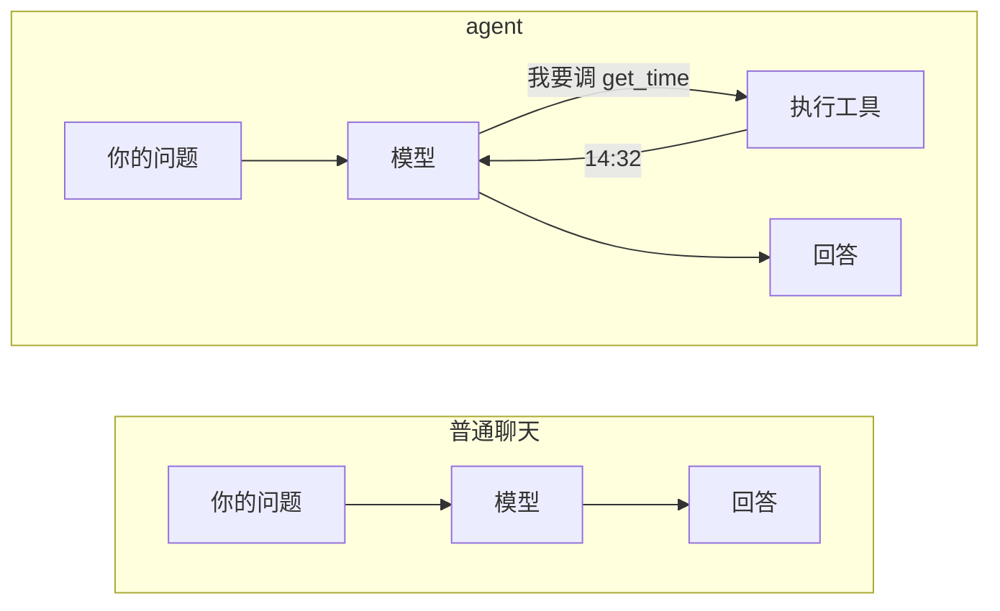
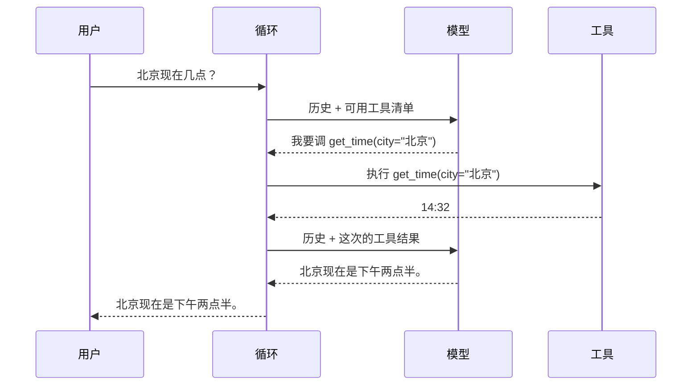
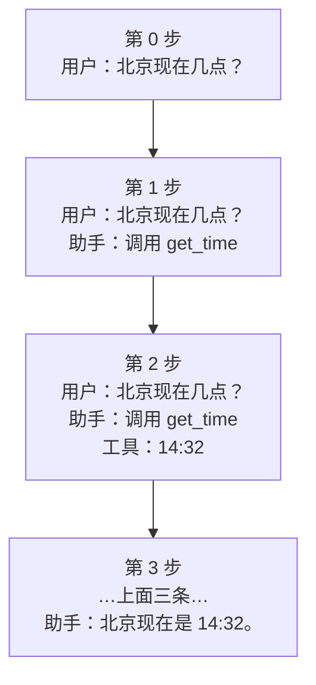

# 全景：agent 到底在做什么

先看一个具体的问题。你问一个语言模型：

> 北京现在几点？

它答不上来。不是因为它笨，是因为**它没有表**。模型是一个函数：给它一串文字，
它吐出接下来最像样的文字。它不会看时钟、不会读文件、不会执行命令。
它知道的一切都停在训练那一刻。

于是它只有两种反应：编一个时间给你，或者老实说「我查不到实时信息」。
两种都不解决问题。

**agent 就是为了解决这件事而存在的一层东西。** 它不让模型变聪明，
它给模型配一副手脚，再加一个反复追问的循环。

## 普通聊天和 agent 差在哪



差别只有一处：**中间那条回头的箭头**。

普通聊天是一次性的：问题进去，回答出来，结束。agent 多了一个环节——
模型可以说「我还答不了，先帮我做件事」。我们做完，把结果送回去，再问它一次。
这个「再问一次」可以重复，直到它说「够了，我的回答是……」。

整门课都在把这条回头箭头做扎实。

## 三个角色，各管一件事

| 角色 | 它管什么 | 它不管什么 |
|---|---|---|
| **模型** | 判断该干什么、把结果组织成人话 | 真的去干；它只会「要求」 |
| **工具** | 真的去查表、读文件、执行命令 | 判断什么时候该被调用 |
| **循环** | 在两者之间传话，并决定什么时候停 | 上面两件事 |

三者的边界值得记住，因为**后面所有的设计争论都是在挪这条边界**：
哪些事该由代码保证，哪些事可以交给模型判断。这条线画在哪儿，
决定了一个 agent 是能用还是只能演示。

## 一次完整的往返长什么样



注意**模型被问了两次**。第一次它说「我要调工具」，第二次它才给出答案。
这就是「一轮对话，两次模型调用」——用户看到的是一问一答，
底下发生的是一个小循环。

也请注意：**工具的结果没有直接给用户**。「14:32」不是答案，
它是给模型的原料。把原料组织成一句人话，是模型的活。

## 这一页的代码怎么跑

Go 是编译型语言，没有像 Python 那样的长驻内核。这里用的是**累积编译**：
同一页里前面格子写下的文件会保留，点「运行」时把到这一格为止的文件一起编译。

每格开头那行 `// file: xxx.go` 决定它写进哪个文件，同名会覆盖。两条约束：

- 跨格子要用的东西**不要写在 `main.go` 里**——后面每一格都有自己的 `main`。
- 每一格都要能**独立编译**，不能引用后面格子才定义的东西。

没有 `main` 函数的格子只做编译检查，有 `main` 的会真的跑起来。

## 亲手跑一遍

先定几个类型。这一格没有 `main`，所以点运行只会做编译检查——**这本身就是 Go 的一个好处**：
类型对不对，编译器立刻告诉你。

```go
// file: stub.go
package main

import "fmt"

// Reply 模型这一轮的回应：要么说话，要么要求调工具。
//
// 用一个结构体带 Kind 字段，而不是两个不相干的类型：
// 调用方拿到它要先判断是哪一种，判别字段让这件事显式。
type Reply struct {
	Kind string // "text" 或 "tool_use"
	Text string
	Name string
	Args map[string]any
}

// fakeModel 假模型。看历史里有没有工具结果：
// 没有就要求调工具，有了就给最终回答。
//
// 不联网，每次结果都一样。第 5 章会说明为什么先用假模型
// 是这门课最重要的一个安排。
func fakeModel(history []map[string]string) Reply {
	for i := len(history) - 1; i >= 0; i-- {
		if history[i]["role"] == "tool" {
			return Reply{Kind: "text", Text: fmt.Sprintf("北京现在是 %s。", history[i]["content"])}
		}
	}
	return Reply{Kind: "tool_use", Name: "get_time", Args: map[string]any{"city": "北京"}}
}

func getTime(city string) string { return "14:32" }
```

现在写循环。这一格有 `main`，点运行会真的执行：

```go
// file: main.go
package main

import "fmt"

func main() {
	history := []map[string]string{
		{"role": "user", "content": "北京现在几点？"},
	}

	for round := 1; round <= 5; round++ {
		reply := fakeModel(history)

		if reply.Kind == "text" {
			fmt.Printf("第 %d 轮：模型给出最终回答 → %s\n", round, reply.Text)
			break
		}

		fmt.Printf("第 %d 轮：模型要求调 %s(%v)\n", round, reply.Name, reply.Args)
		history = append(history, map[string]string{
			"role": "assistant", "content": "调用 " + reply.Name})

		city, _ := reply.Args["city"].(string)
		output := getTime(city)
		fmt.Printf("        我们执行了它，拿到 %s\n", output)
		history = append(history, map[string]string{"role": "tool", "content": output})
	}
}
```

输出里有两轮：第一轮模型要求调工具，第二轮它给出答案。
**这就是一个 agent 的全部骨架**——剩下十九章都在给这个骨架加东西：
真模型、真工具、出错怎么办、记忆放哪、怎么知道它做得对不对。

## 历史是怎么长起来的

上面那个 `history` 切片是整件事的核心。每一轮，它都会变长：



每次问模型，我们发过去的都是**当前的全部历史**。模型自己不记事——
它上一次说过什么，全靠我们把记录再递给它一遍。

这一点是后面很多设计的源头：

- 历史会越来越长，而模型的上下文有上限 → 第 16 章的压缩。
- 历史要能存下来、能读回来 → 第 14 章的持久化。
- 用户想重来一次而不丢掉旧的 → 第 15 章的会话树。

把它打出来看看：

```go
// file: main.go
package main

import "fmt"

func main() {
	history := []map[string]string{
		{"role": "user", "content": "北京现在几点？"},
	}
	for round := 1; round <= 5; round++ {
		reply := fakeModel(history)
		if reply.Kind == "text" {
			history = append(history, map[string]string{
				"role": "assistant", "content": reply.Text})
			break
		}
		history = append(history, map[string]string{
			"role": "assistant", "content": "调用 " + reply.Name})
		city, _ := reply.Args["city"].(string)
		history = append(history, map[string]string{
			"role": "tool", "content": getTime(city)})
	}

	fmt.Printf("这次对话最终有 %d 条消息：\n\n", len(history))
	for i, m := range history {
		fmt.Printf("  %d. %-10s %s\n", i+1, m["role"], m["content"])
	}
	fmt.Println("\n每一次调用模型，发过去的都是当时的全部历史——模型自己不记事。")
}
```

## 三个常见的误解

**「agent 就是给模型套个提示词。」** 不是。提示词影响的是模型的措辞和倾向，
而 agent 的本事来自**真的去执行**。第 18 章会把这句话说得更狠：
提示词不是安全边界——写「不要删文件」挡不住任何事，真正的边界必须是代码里的机制。

**「模型会自己调用工具。」** 不会。模型只会**输出一段话说它想调什么**，
真正的执行是我们做的。这个区别不是咬文嚼字：正因为执行权在我们手里，
才谈得上校验参数、要人审批、限制范围。

**「循环轮数越多越好。」** 不是。模型会陷入循环——反复调同一个工具，
或者两个工具互相触发。第 10 章会给循环装上预算，第 12 章会讲怎么识别它在犯病。

## 本章小结

- 模型是一个**只会吐文字的函数**。它没有手脚，也不记事。
- agent 给它加了两样东西：**能真的执行的工具**，和一个**反复追问的循环**。
- 一轮对话对应**多次模型调用**：要求调工具、拿到结果、再问一次。
- 工具的结果**不是答案**，是给模型的原料。
- 每次调用模型，发过去的是**当时的全部历史**——记事的是我们，不是它。
- Go 这边的两条约束：跨格子的东西不写在 `main.go` 里，每一格都要能独立编译。

下一章：把 `map[string]string` 这种随手写的结构，换成一套撑得住真实情况的消息类型——
因为一条助手消息经常要**同时**装下「它说的话」和「它要调的工具」，一个字符串装不下。
