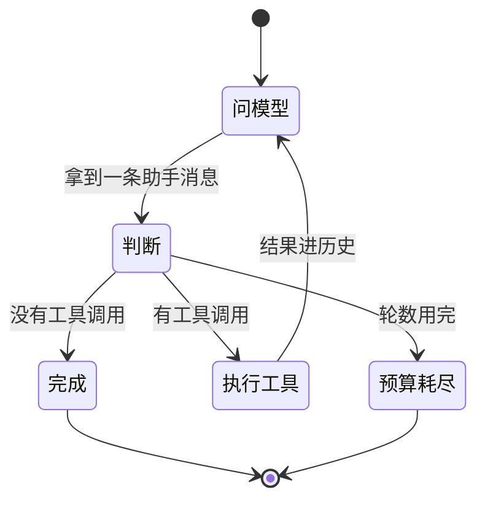
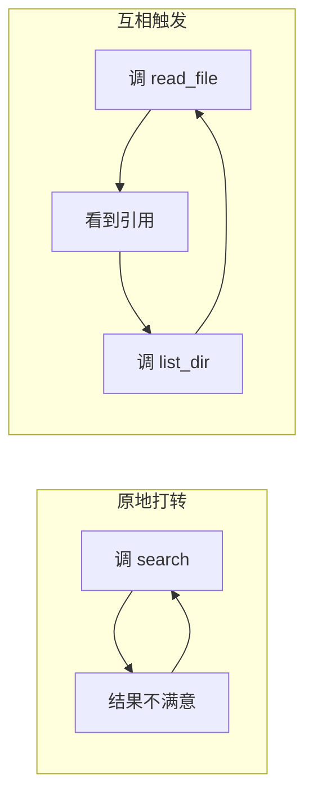

# 主循环

前九章的 `run` 一直是个草稿：一个 for 循环，跑满次数就返回一句「循环了 N 轮还没结束」。
这一章把它写成正经的东西。

主循环是 agent 的心脏。它只做一件事——**在模型和工具之间来回传话**——
但这件事里藏着四个必须回答的问题：

| 问题 | 答不好会怎样 |
|---|---|
| 什么时候停？ | 该停不停，或者该继续时提前收工 |
| 停不下来怎么办？ | 模型反复调同一个工具，一直烧钱直到你发现 |
| 一轮里多个工具调用怎么办？ | 用户干等着它们排队 |
| 每一步要让外界知道什么？ | 界面上一片空白，用户以为卡死了 |

这一章回答前两个和第四个，第三个留给下一章。

## 先看清楚循环的形状



图上有两个出口，不是一个。这是这一章第一个要点：

> **「答完了」和「预算用完了」是两种不同的结束**，调用方必须能区分。

前者可以直接把答案展示给用户；后者应该提示「它还没做完，要不要继续」。
如果 `run` 只返回一个字符串，这个区别就丢了——用户会把一句半截话当成最终答案。

## 本章起点

从这一章开始，前面各章的成果收进了这一部分目录下的 `_prelude/`。
它就是你前九章逐格写出来的代码，一行没改，只是不再每章重贴一遍——
累积编译时它们会先被铺进编译目录。

想看某一段当初怎么来的，打开 `_prelude/core.go`（第 2 到 8 章：消息、内容块、
线上格式、流式解析、真模型）和 `_prelude/tools.go`（第 9 章：工具契约、
参数校验、登记处、两个示例工具）。

这一格没有 `main`，运行它等于让编译器把铺底代码检查一遍：

```go
// file: check.go
package main

// 这一格不写任何东西，只是让编译器把 _prelude 里的代码过一遍。
// 通过就说明前九章的成果都在场，可以往下写了。
```

## 停止的四种理由

草稿版只有一种停法：模型不调工具了。真实的主循环有四种：

```go
// file: turn.go
package main

type StopReason string

const (
	StopCompleted StopReason = "completed" // 模型给出了最终回答，正常结束
	StopBudget    StopReason = "budget"    // 循环预算用完了，它还想接着调工具
	StopCancelled StopReason = "cancelled" // 外部要求停下（下一章讲）
	StopError     StopReason = "error"     // 模型调用本身失败了
)

// TurnResult 一轮的结果。
//
// 为什么不只返回一个字符串：调用方需要区分上面那四种情况。
// 尤其是「答完了」和「预算用完了」——前者可以直接展示，
// 后者应该提示用户「它还没做完」。
type TurnResult struct {
	Text       string
	StopReason StopReason
	RoundsUsed int
	Messages   []Message // 这一轮新增的消息
	Err        error
}

func (r TurnResult) Completed() bool { return r.StopReason == StopCompleted }
```

## 为什么必须有预算

模型会陷入循环。最常见的两种形态：



两种都不会返回 error，不会 panic，程序看起来一切正常——**只是永远不结束**。
一个没有预算的 agent 会一直烧钱直到你发现。

预算不是「防御性编程」那种可有可无的谨慎，它是**这个循环能不能上线的前提**。

## 事件流在这里派上用场

第 3 章造的事件流一直没怎么用。主循环是它真正的用武之地：
每一步都往流上发一件事，界面订阅它就能实时显示。

不这么做的替代方案是让主循环直接 `fmt.Println`——那样换个界面（网页、命令行、日志）
就得改主循环。**发事件的人不该关心谁在听。**

Go 版本比 Python 版本多一样东西：**锁**。事件可能从任何一个 goroutine 上发出来
（模型的读流 goroutine 就是一个），订阅者列表的读写必须串行化。

```go
// file: events.go
package main

import (
	"fmt"
	"sync"
)

type Event struct {
	Kind string
	Data map[string]any
}

type EventStream struct {
	mu   sync.RWMutex
	subs map[int]func(Event)
	next int
}

func NewEventStream() *EventStream {
	return &EventStream{subs: map[int]func(Event){}}
}

// Subscribe 登记一个订阅者，返回取消订阅的函数。
//
// 返回一个闭包而不是让调用方记住编号：调用方拿到什么就用什么，
// 不必知道内部是用编号还是别的什么管理的。
func (s *EventStream) Subscribe(fn func(Event)) func() {
	s.mu.Lock()
	defer s.mu.Unlock()
	id := s.next
	s.next++
	s.subs[id] = fn
	return func() {
		s.mu.Lock()
		defer s.mu.Unlock()
		delete(s.subs, id)
	}
}

// Emit 广播一个事件。两个要点：
//
//  1. 先在锁里把订阅者拷出来，再在锁外调用。否则订阅者里如果调了 Subscribe
//     或 Emit，就会死锁——它要拿的锁正被自己这次调用持有着。
//  2. 订阅者 panic 不能连累发事件的人。界面代码出 bug 是常事，
//     不该让 agent 跟着一起死。
func (s *EventStream) Emit(kind string, data map[string]any) {
	s.mu.RLock()
	handlers := make([]func(Event), 0, len(s.subs))
	for _, fn := range s.subs {
		handlers = append(handlers, fn)
	}
	s.mu.RUnlock()

	event := Event{Kind: kind, Data: data}
	for _, fn := range handlers {
		func() {
			defer func() {
				if r := recover(); r != nil {
					fmt.Printf("  [订阅者出错，已忽略] %v\n", r)
				}
			}()
			fn(event)
		}()
	}
}
```

主循环会发这几种事件：

| 事件 | 什么时候 | 界面拿它做什么 |
|---|---|---|
| `text_delta` | 模型每吐出几个字 | 打字机效果 |
| `tool_start` | 开始执行某个工具 | 显示「正在查询…」 |
| `tool_end` | 工具执行完 | 显示结果摘要、打勾或打叉 |
| `turn_done` | 这一轮结束 | 收起状态条，标明结束原因 |

## 写出来

```go
// file: loop.go
package main

// AgentLoop 一轮对话的主循环。
//
// 职责边界很窄：只管「问模型 → 执行工具 → 再问模型」这个循环本身。
// 历史存哪、会话怎么组织，是第 13、14 章的事。
type AgentLoop struct {
	Model     Model
	Registry  *ToolRegistry
	Stream    *EventStream
	MaxRounds int
}

func NewAgentLoop(model Model, reg *ToolRegistry, stream *EventStream) *AgentLoop {
	if stream == nil {
		stream = NewEventStream()
	}
	return &AgentLoop{Model: model, Registry: reg, Stream: stream, MaxRounds: 8}
}

func (l *AgentLoop) Run(history []Message) TurnResult {
	turnID := newID("turn")
	var newMessages []Message
	l.Stream.Emit("turn_start", map[string]any{"turn_id": turnID})

	for round := 1; round <= l.MaxRounds; round++ {
		reply, err := l.oneRound(append(append([]Message{}, history...), newMessages...))
		if err != nil {
			// 模型调用失败：网络断了、服务返回 500、响应格式不对。
			// 这类错误不该让调用方拿到一个裸 error——它拿到的应该是一个
			// 「这轮失败了」的结果，里面还带着已经产生的消息。
			l.Stream.Emit("error", map[string]any{"message": err.Error()})
			return TurnResult{StopReason: StopError, RoundsUsed: round,
				Messages: newMessages, Err: err}
		}

		newMessages = append(newMessages, reply)
		calls := reply.ToolUses()

		if len(calls) == 0 {
			l.Stream.Emit("turn_done", map[string]any{"reason": string(StopCompleted)})
			return TurnResult{Text: reply.Text(), StopReason: StopCompleted,
				RoundsUsed: round, Messages: newMessages}
		}

		var results []Block
		for _, call := range calls {
			l.Stream.Emit("tool_start", map[string]any{"name": call.Name, "args": call.Args})
			r := l.Registry.Execute(call.Name, call.Args)
			l.Stream.Emit("tool_end", map[string]any{
				"name": call.Name, "ok": !r.IsError, "output": r.Content})
			results = append(results, ToolResultBlock{
				ToolUseID: call.ID, Content: r.Content, IsError: r.IsError})
		}
		newMessages = append(newMessages, NewMessage("tool", results...))
	}

	l.Stream.Emit("turn_done", map[string]any{"reason": string(StopBudget)})
	text := ""
	if n := len(newMessages); n >= 2 {
		text = newMessages[n-2].Text()
	}
	return TurnResult{Text: text, StopReason: StopBudget,
		RoundsUsed: l.MaxRounds, Messages: newMessages}
}

// oneRound 问一次模型，把增量转成事件，返回攒好的消息。
func (l *AgentLoop) oneRound(messages []Message) (Message, error) {
	deltas, errs := l.Model.Stream(messages, l.Registry.Specs())

	var textParts []string
	var blocks []Block
	flushText := func() {
		if len(textParts) > 0 {
			joined := ""
			for _, p := range textParts {
				joined += p
			}
			blocks = append(blocks, TextBlock{Text: joined})
			textParts = nil
		}
	}

	for d := range deltas {
		switch d.Kind {
		case "text":
			textParts = append(textParts, d.Text)
			l.Stream.Emit("text_delta", map[string]any{"delta": d.Text})
		case "tool_use":
			if d.Tool != nil {
				flushText()
				blocks = append(blocks, *d.Tool)
			}
		}
	}
	flushText()

	// 这里有个必须守住的次序：deltas 循环跑完了才能读 errs。
	// 反过来（先读 errs）会死锁——发送方要等 deltas 被读空才会往 errs 里写。
	if err := <-errs; err != nil {
		return Message{}, err
	}
	return NewMessage("assistant", blocks...), nil
}
```

**这一章新写的全部代码就是上面这些**——消息结构、线上格式翻译、工具契约，
都在 `_prelude` 里躺着，这里只是把它们串起来。

## 跑一次，看事件流

订阅几个事件，把它们打印出来。这段代码就是一个最简陋的「界面」：

```go
// file: main.go
package main

import "fmt"

func main() {
	stream := NewEventStream()
	stream.Subscribe(func(e Event) {
		switch e.Kind {
		case "text_delta":
			fmt.Print(e.Data["delta"])
		case "tool_start":
			fmt.Printf("\n  ⚙ 开始执行 %v(%v)\n", e.Data["name"], e.Data["args"])
		case "tool_end":
			mark := "✓"
			if ok, _ := e.Data["ok"].(bool); !ok {
				mark = "✗"
			}
			fmt.Printf("  %s %v → %v\n", mark, e.Data["name"], e.Data["output"])
		case "turn_done":
			fmt.Printf("\n  ── 这一轮结束，原因：%v\n", e.Data["reason"])
		}
	})

	reg := NewToolRegistry(GetTimeTool{}, NewCalcTool())
	model := NewOpenAICompatModel("http://192.168.213.116:8084/v1", "qwen3.6-27B")
	loop := NewAgentLoop(model, reg, stream)

	result := loop.Run([]Message{
		NewMessage("system", TextBlock{Text: "你可以使用工具。算数一律调用工具，不要心算。"}),
		NewMessage("user", TextBlock{Text: "(128 + 47) * 3 等于多少？再告诉我北京现在几点。"}),
	})

	fmt.Printf("\n停止原因：%s\n", result.StopReason)
	fmt.Printf("用了 %d 轮，新增 %d 条消息\n", result.RoundsUsed, len(result.Messages))
	fmt.Printf("最终答案：%s\n", result.Text)
}
```

看输出里事件的顺序：文字增量、工具开始、工具结束、下一轮的文字增量……
**一个 agent 界面需要显示的信息，全在这条流上。**

## 让预算真的用完

把预算压到 2 轮，再给它一个做不完的任务：

```go
// file: main.go
package main

import "fmt"

func main() {
	reg := NewToolRegistry(GetTimeTool{}, NewCalcTool())
	model := NewOpenAICompatModel("http://192.168.213.116:8084/v1", "qwen3.6-27B")

	loop := NewAgentLoop(model, reg, nil)
	loop.MaxRounds = 2

	result := loop.Run([]Message{
		NewMessage("system", TextBlock{Text: "你可以使用工具。每次只算一步，不要一次算完。"}),
		NewMessage("user", TextBlock{Text: "依次算出：1+1、然后结果乘 3、然后再加 10、然后再乘 2。每一步都要调用工具。"}),
	})

	fmt.Printf("停止原因：%s\n", result.StopReason)
	fmt.Printf("用了 %d 轮\n", result.RoundsUsed)
	if result.StopReason == StopBudget {
		fmt.Println("→ 界面应当提示：它还没做完，要不要让它继续？")
	}
}
```

这就是那两个出口的区别在代码里的样子。如果 `Run` 只返回一个字符串，
上面那个 `if` 根本写不出来。

## 一轮里可能有多个工具调用

模型可以在**同一轮**里同时要求算数和查时间。数一下它调了几次工具、用了几轮：

```go
// file: main.go
package main

import (
	"fmt"
	"sync"
)

func main() {
	// 订阅者可能在别的 goroutine 上被调用，所以这个计数器要加锁。
	// 这是 Go 里用事件流时最容易忘的一件事。
	var mu sync.Mutex
	var names []string

	stream := NewEventStream()
	stream.Subscribe(func(e Event) {
		if e.Kind == "tool_start" {
			mu.Lock()
			names = append(names, fmt.Sprint(e.Data["name"]))
			mu.Unlock()
		}
	})

	reg := NewToolRegistry(GetTimeTool{}, NewCalcTool())
	model := NewOpenAICompatModel("http://192.168.213.116:8084/v1", "qwen3.6-27B")
	result := NewAgentLoop(model, reg, stream).Run([]Message{
		NewMessage("system", TextBlock{Text: "你可以使用工具。算数一律调用工具。"}),
		NewMessage("user", TextBlock{Text: "算一下 7*8，同时告诉我上海现在几点。"}),
	})

	mu.Lock()
	fmt.Printf("一共调了 %d 次工具：%v\n", len(names), names)
	mu.Unlock()
	fmt.Printf("用了 %d 轮 —— 如果是 1 轮，说明模型把两个调用放在了同一轮里\n", result.RoundsUsed)
	fmt.Println("答案：", result.Text)
}
```

同一轮里的多个调用现在是**顺序执行**的。如果每个工具要跑几秒，用户就得等它们排队。
下一章解决这个，顺带解决「用户中途想喊停」。

## 本章小结

- 主循环的职责边界很窄：**只管问模型、执行工具、再问模型**。
- 循环有**两个出口**，不是一个。「答完了」和「预算用完了」要让调用方区分得开。
- **必须有循环预算**。模型陷入循环时不返回 error 也不 panic，只是永远不结束。
- 模型调用失败要变成 `TurnResult{StopReason: StopError}`，**不要把裸 error 抛给调用方**。
- 事件流在 Go 里要加锁，而且**订阅者列表要先拷出来再在锁外调用**，否则订阅者一回调就死锁。
- 读通道有次序：**deltas 读空了才能读 errs**，反过来会死锁。
- 这一章真正新写的代码就是事件流加主循环，其余都在 `_prelude` 里。

下一章：同一轮里的多个工具调用**并发执行**，以及用户中途按下停止时怎么干净地退出。
难点不在「怎么停」，而在**停完之后对话历史还能不能用**——`context.Context` 该登场了。
