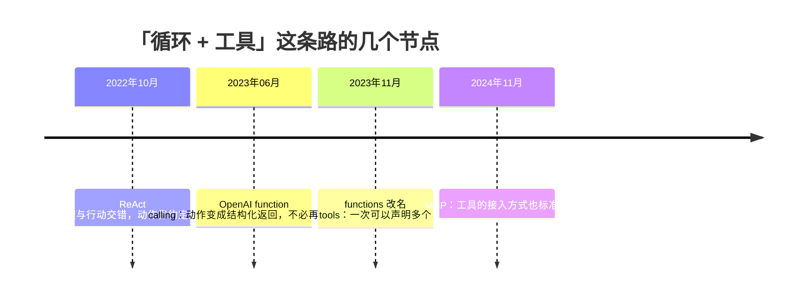
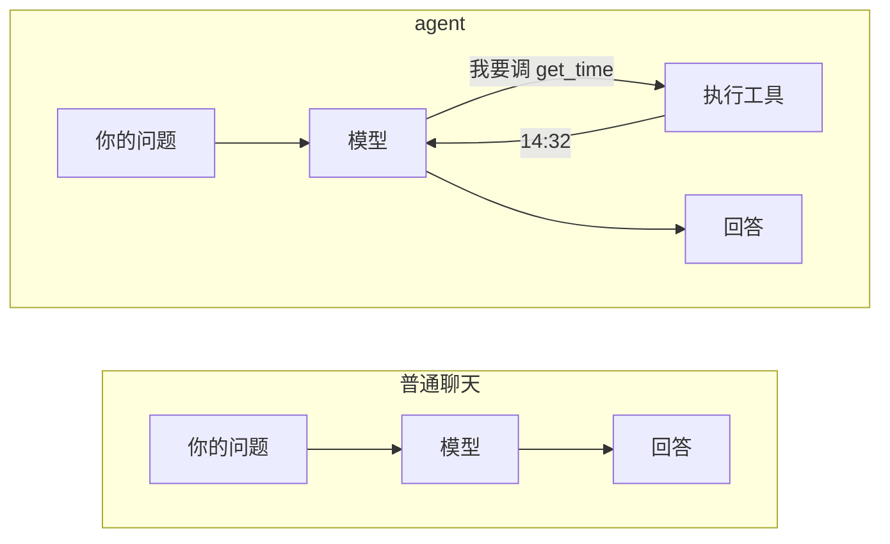
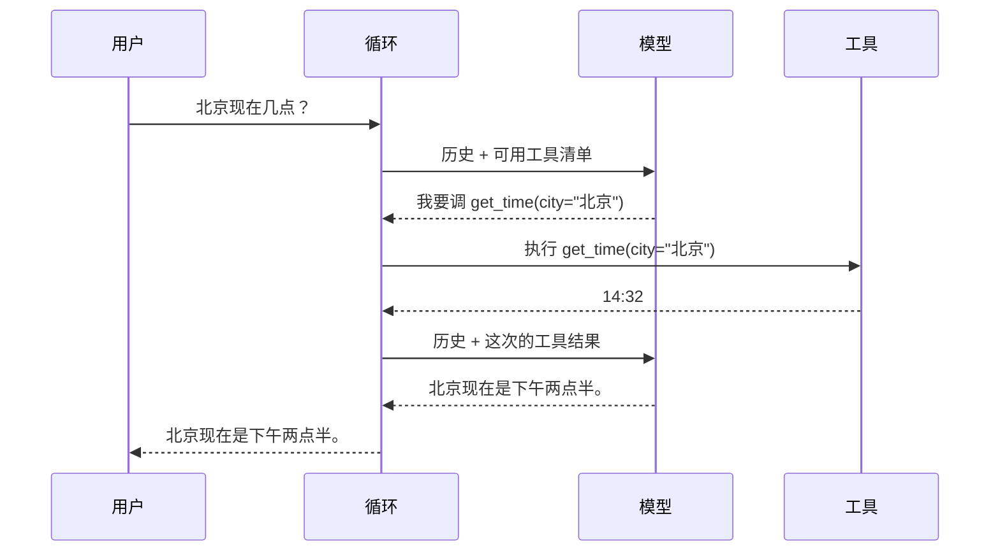
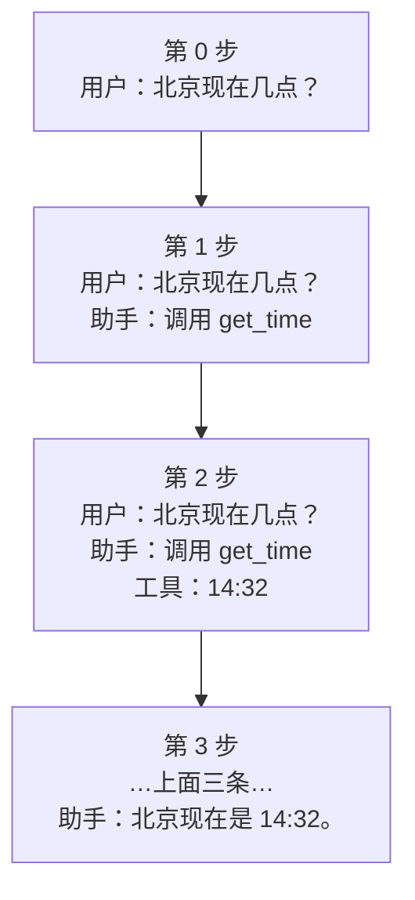

# 全景：agent 到底在做什么

先看一个具体的问题。你问一个语言模型：

> 北京现在几点？

它答不上来。不是因为它笨，是因为**它没有表**。模型是一个函数：给它一串文字，
它吐出接下来最像样的文字。它不会看时钟、不会读文件、不会执行命令。
它知道的一切都停在训练那一刻。

于是它只有两种反应：编一个时间给你，或者老实说「我查不到实时信息」。
两种都不解决问题。

**agent 就是为了解决这件事而存在的一层东西。** 它不让模型变聪明，
它给模型配一副手脚，再加一个反复追问的循环。

## 这个词的两段身世

「agent」被用得很滥，先把它的来历说清楚，你以后读别人的文章才不会串台。

**第一段身世在大模型之前。** 人工智能教科书里，agent 指的是「能感知环境、
并对环境采取行动的东西」——一个恒温器是 agent，一个下棋程序是 agent，
强化学习里那个在环境中试错的主体也叫 agent。这个用法强调的是
**感知—行动的循环**，跟语言模型没关系。

**第二段身世是 2022 年之后。** 人们发现语言模型也能被放进这样一个循环里：
让它「说」出想做什么，我们替它做，再把结果告诉它。于是「agent」这个旧词
被借来指这类系统。

两段身世共享的内核是同一个：**循环里有感知，有行动**。
不同的是行动的执行者——旧的 agent 自己动手，新的 agent 只会开口要求，
真正动手的是我们写的代码。这个区别贯穿整门课，第 18 章会把它推到极致。

> [!要点]
> 模型只会输出一段话说它想调什么，真正的执行是我们做的。
> 正因为执行权在我们手里，才谈得上校验参数、要人审批、限制范围。

## 这套「边想边做」的模式是谁提出的

2022 年 10 月，一篇叫 **ReAct** 的论文（Reasoning + Acting）把这件事讲清楚了。
它的主张是：**推理和行动不该分开做，而该交错着做**。原文摘要里的关键句是：

> "reasoning traces help the model induce, track, and update action plans as well as
> handle exceptions, while actions allow it to interface with and gather additional
> information from external sources such as knowledge bases or environments."

翻成人话：让模型一边说出自己的思路，一边去外面取信息，两者互相帮忙——
思路帮它决定下一步取什么，取回来的东西帮它修正思路。

在 ReAct 那个年代，「行动」是靠**约定文本格式**实现的：让模型输出
`Action: search[北京时间]` 这样的一行，程序用正则去解析。这很脆——
模型多打一个空格、换个措辞，解析就崩了。

2023 年 6 月，OpenAI 把这件事变成了 API 的一等公民：**function calling**。
你把可用函数的名字和参数结构声明给模型，模型直接返回一个结构化的调用请求，
不再需要你去解析自然语言。后来这个参数从 `functions` 改名成更通用的 `tools`。

2024 年 11 月，Anthropic 又提出 **MCP**（Model Context Protocol），
把「工具怎么接进来」也标准化了——工具不必写死在你的程序里，可以由一个独立的
服务提供。这门课不用 MCP，但你要知道它在解决的是同一条链路的另一端。



**我们这门课站在 2023 年 6 月那个节点上**：用结构化的工具调用，
自己写循环。理解了这一层，再去看 MCP 或者别的框架都只是换皮。

## 普通聊天和 agent 差在哪



差别只有一处：**中间那条回头的箭头**。

普通聊天是一次性的：问题进去，回答出来，结束。agent 多了一个环节——
模型可以说「我还答不了，先帮我做件事」。我们做完，把结果送回去，再问它一次。
这个「再问一次」可以重复，直到它说「够了，我的回答是……」。

整门课都在把这条回头箭头做扎实。

## 三个角色，各管一件事

| 角色 | 它管什么 | 它不管什么 |
|---|---|---|
| **模型** | 判断该干什么、把结果组织成人话 | 真的去干；它只会「要求」 |
| **工具** | 真的去查表、读文件、执行命令 | 判断什么时候该被调用 |
| **循环** | 在两者之间传话，并决定什么时候停 | 上面两件事 |

三者的边界值得记住，因为**后面所有的设计争论都是在挪这条边界**：
哪些事该由代码保证，哪些事可以交给模型判断。这条线画在哪儿，
决定了一个 agent 是能用还是只能演示。

## 什么时候用不着 agent

这一节可能是全章最省钱的一节。

Anthropic 在《Building effective agents》里把这类系统分成两种：

- **workflow**：LLM 和工具沿着**你预先写死的代码路径**被编排；
- **agent**：LLM **自己决定**走哪条路、用什么工具。

它给出的建议很直白：

> "optimizing single LLM calls with retrieval and in-context examples is usually enough"

也就是说，**多数任务用不着 agent**。agent 是拿延迟和成本去换任务表现的，
只有在简单方案确实不够时才值得加这层复杂度。

判断很简单：**你能不能提前画出这个任务的流程图？**
能画出来，就写 workflow——它更快、更便宜、更容易测。
画不出来（因为下一步取决于上一步的结果），才需要 agent。

> [!坑]
> 一个常见的浪费：把「读一个文件然后总结」做成 agent。
> 这件事的流程是固定的，一次调用加一次读文件就够了，
> 让模型自己决定要不要读文件只是徒增两次往返。

## 一次完整的往返长什么样



注意**模型被问了两次**。第一次它说「我要调工具」，第二次它才给出答案。
这就是「一轮对话，两次模型调用」——用户看到的是一问一答，
底下发生的是一个小循环。

也请注意：**工具的结果没有直接给用户**。「14:32」不是答案，
它是给模型的原料。把原料组织成一句人话，是模型的活。

## 动手之前，先预测

下面那段代码把上面那张时序图原样写出来。**在点运行之前，先在心里回答三个问题**：

1. 循环会转几轮？
2. 第一轮里 `reply` 的 `type` 是什么？
3. 如果把 `get_time` 的返回值改成别的字符串，最终答案会跟着变吗？

带着答案去看输出，比直接看输出记得牢。

## 亲手跑一遍

模型是假的——用几行判断冒充，这样不联网也能跑，而且每次结果都一样。
第 5 章会说明为什么**先用假模型**是这门课最重要的一个安排。

```python
def fake_model(history):
    """假模型。看历史里有没有工具结果：没有就要求调工具，有了就给最终回答。"""
    tool_outputs = [m["content"] for m in history if m["role"] == "tool"]
    if tool_outputs:
        return {"type": "text", "text": f"北京现在是 {tool_outputs[-1]}。"}
    return {"type": "tool_use", "name": "get_time", "args": {"city": "北京"}}


def get_time(city):
    return "14:32"


history = [{"role": "user", "content": "北京现在几点？"}]

for round_no in range(1, 6):
    reply = fake_model(history)

    if reply["type"] == "text":
        print(f"第 {round_no} 轮：模型给出最终回答 → {reply['text']}")
        break

    print(f"第 {round_no} 轮：模型要求调 {reply['name']}({reply['args']})")
    history.append({"role": "assistant", "content": f"调用 {reply['name']}"})
    output = get_time(**reply["args"])
    print(f"        我们执行了它，拿到 {output}")
    history.append({"role": "tool", "content": output})
```

两轮。第一轮模型要求调工具，第二轮它给出答案。
**这就是一个 agent 的全部骨架**——剩下十九章都在给这个骨架加东西：
真模型、真工具、出错怎么办、记忆放哪、怎么知道它做得对不对。

第三个问题的答案是「会变」。把 `get_time` 改成 `return "凌晨三点"` 再跑一次，
你会看到最终答案跟着变了——**这就是「工具结果是原料」的意思**。

## 历史是怎么长起来的

上面那个 `history` 列表是整件事的核心。每一轮，它都会变长：



每次问模型，我们发过去的都是**当前的全部历史**。模型自己不记事——
它上一次说过什么，全靠我们把记录再递给它一遍。

这一点是后面很多设计的源头：

- 历史会越来越长，而模型的上下文有上限 → 第 16 章的压缩。
- 历史要能存下来、能读回来 → 第 14 章的持久化。
- 用户想重来一次而不丢掉旧的 → 第 15 章的会话树。

```python
print(f"这次对话最终有 {len(history)} 条消息：\n")
for i, m in enumerate(history, 1):
    print(f"  {i}. {m['role']:9} {m['content']}")

print("\n每一次调用模型，发过去的都是当时的全部历史——模型自己不记事。")
```

## 真实的实现是怎么组织的

这门课参照 **pi**（`earendil-works/pi`，MIT 协议，TypeScript 写的）来安排。
它把整件事切成三个包，这个切法值得先看一眼：

| 包 | 职责 | 对应本课 |
|---|---|---|
| `pi-ai` | 统一各家模型的接口：消息、内容块、流式事件、工具声明 | 第 2、6、7、8 章 |
| `pi-agent-core` | agent 运行时：主循环、工具执行、状态、事件 | 第 3、9 到 13 章 |
| `pi-coding-agent` | 面向用户的编码 agent 命令行 | 第 17 到 20 章 |

**注意最底下那一层是「统一模型接口」而不是「主循环」。** 这不是随便排的：
各家模型服务的差异（消息格式、流式事件、工具怎么声明）如果不先按平，
会一路渗进主循环，最后每加一家服务就要改一遍循环。
第 6 章会专门讲这个隔离层，那时候你会更有体会。

pi 支持三十多家模型服务，而它的主循环不知道自己接的是哪一家——
**这就是那条分界线的价值**。

## 三个常见的误解

**「agent 就是给模型套个提示词。」** 不是。提示词影响的是模型的措辞和倾向，
而 agent 的本事来自**真的去执行**。第 18 章会把这句话说得更狠：
提示词不是安全边界——写「不要删文件」挡不住任何事，真正的边界必须是代码里的机制。

**「模型会自己调用工具。」** 不会。这一点前面说过，值得再说一遍，
因为它是后面所有权限设计的地基。

**「循环轮数越多越好。」** 不是。模型会陷入循环——反复调同一个工具，
或者两个工具互相触发。这类故障**不报错、不崩溃、程序看起来一切正常**，
只是永远不结束。第 10 章会给循环装上预算，第 12 章讲怎么识别它在犯病。

> [!小结]
> 模型只会吐文字，也不记事。agent 给它加了两样东西：能真的执行的工具，
> 和一个反复追问的循环。工具的结果不是答案，是给模型的原料。
> 记事的是我们，不是它。

## 随堂自测

```quiz
- 题目: 用户问「北京现在几点」，一个带 get_time 工具的 agent 一共会调用几次模型？
  选项:
    A: 一次——模型直接给出答案
    B: 两次——第一次要求调工具，第二次根据结果给出答案
    C: 三次——还要一次来决定用哪个工具
  答案: B
  解析: 第一次调用模型返回的是「我要调 get_time」，不是答案；我们执行工具、把结果追加进历史之后，再问一次，它才给出最终回答。这就是「一轮对话，两次模型调用」。

- 题目: 下面哪件事更适合用 workflow 而不是 agent？
  选项:
    A: 排查一个线上故障，下一步查什么取决于上一步看到的日志
    B: 把用户上传的文件读进来，总结成三百字
    C: 帮我改一个 bug，需要先找到相关文件再改
  答案: B
  解析: 判据是「你能不能提前画出这个任务的流程图」。读文件加总结的流程是固定的，一次模型调用加一次读文件就够了，做成 agent 只是徒增往返。A 和 C 的下一步都取决于上一步的结果，画不出固定流程，才需要 agent。

- 题目: 「模型调用了 get_time 工具」这句话哪里说得不准确？
  选项:
    A: 没有不准确，模型确实调用了工具
    B: 模型只是输出了一个调用请求，真正执行的是我们的代码
    C: 应该说「工具调用了模型」
  答案: B
  解析: 模型的输出永远只是文字（或结构化的调用请求）。它没有执行任何东西的能力。执行权在我们的循环里——正因为如此，才谈得上校验参数、要人审批、限制范围。这是第 18 章全部权限设计的地基。

- 题目: 为什么每次调用模型都要把**全部历史**发过去？
  选项:
    A: 为了让模型知道我们还在
    B: 因为模型本身不保存任何状态，它上一次说过什么全靠我们再递一遍
    C: 因为接口要求必须这样
  答案: B
  解析: 模型是一个无状态的函数：给一串文字，吐一串文字。会话的连续感完全是我们维护历史造出来的。这也是第 14 章要持久化、第 16 章要压缩的根本原因——历史是我们的负担，不是它的。
```

## 本章小结

- 模型是一个**只会吐文字的函数**。它没有手脚，也不记事。
- 「agent」这个词有两段身世。共享的内核是**感知—行动的循环**；
  不同的是新 agent **只会要求，不会动手**。
- 这套模式的来路：ReAct（2022，动作靠约定文本）→ function calling（2023，
  动作变成结构化返回）→ MCP（2024，工具接入也标准化）。我们站在第二个节点上。
- **多数任务用不着 agent**。判据：你能不能提前画出流程图。能画就写 workflow。
- 一轮对话对应**多次模型调用**；工具结果**不是答案**，是原料。
- 每次调用发过去的是**当时的全部历史**——记事的是我们。
- 真实实现（pi）把最底层留给「统一模型接口」，而不是主循环。
  这条分界线让它的循环不必知道自己接的是哪一家服务。

下一章：把 `{"role": ..., "content": ...}` 这种随手写的字典，
换成一套撑得住真实情况的消息结构——因为一条助手消息经常要**同时**装下
「它说的话」和「它要调的工具」，一个字符串装不下。

---

**这一章引用的资料**

- ReAct 论文：<https://arxiv.org/abs/2210.03629>
- OpenAI function calling 发布说明：<https://openai.com/index/function-calling-and-other-api-updates/>
- MCP 发布说明：<https://www.anthropic.com/news/model-context-protocol>
- Building effective agents：<https://www.anthropic.com/engineering/building-effective-agents>
- pi 仓库：<https://github.com/earendil-works/pi>
