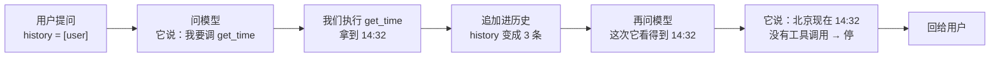

# 全景：agent 到底在做什么

## 一个答不上来的问题

打开任何一个大语言模型的对话框，问它：

> 北京现在几点？

你会得到两种回答之一。一种是老实话：「我无法获取实时信息。」另一种更麻烦——
它给你一个具体的时间，语气笃定，而那个时间是编的。

这件事值得停下来想一想。这个模型能写代码、能解数学题、能讨论哲学，
却答不出一个小学生都知道怎么查的问题。它缺的不是智力，是**一块表**。

再往下追一层：就算你在它旁边真的放一块表，它也读不了。因为它根本
**不具备「读」这个动作**。它能做的只有一件事——生成文字。

这一章要说清楚的就是：当一个只会生成文字的东西需要与真实世界发生关系时，
中间要补上什么。补上的那层东西，就是 agent。

我们会用大约十五个小片段把这层东西从零搭出来。每个片段都能直接跑，
也都能直接改——建议你边读边改，尤其是那些标着「动手试试」的地方。

## 语言模型到底是什么

要理解 agent 为什么必须存在，得先把语言模型看清楚。抛开一切修辞，
它是一个**函数**：

> 输入一串文字，输出接下来最可能出现的文字。

就这一件事。它反复做这件事，一次吐一小块，攒起来就成了你看到的回答。

从这个定义能推出三条性质。这三条是整门课的地基，值得逐条说清楚。

**性质一：它没有状态。** 你和它聊了十轮，它并不「记得」前九轮。真相是：
每一轮我们都把之前的全部对话重新发了一遍。所谓「记忆」，是我们这边维护出来的假象。

**性质二：它没有副作用。** 模型的输出是文字，只是文字。它不会因为「说」了一句
「我现在去读一下 config.txt」就真的读到什么。

**性质三：它的知识有截止时间。** 模型的参数是训练那一刻固定下来的。
之后世界发生的一切，它都不知道。

这三条合起来把能力边界划得很清楚：**它擅长判断和表达，不擅长知道和执行。**
而现实里的任务，恰恰两样都要。

我们先把这三条在代码里坐实一遍，再谈怎么补。

### 把「无状态」变成一个可以观察的事实

先造一个最简陋的模型——它不联网，就是一个函数。这样你能看清楚
「输入什么、输出什么」这件事本身。

```python
def toy_model(prompt: str) -> str:
    """一个玩具模型：输入一串文字，输出一串文字。仅此而已。"""
    if "几点" in prompt:
        return "我无法获取实时信息。"
    return "（我只会根据输入生成文字。）"


print(toy_model("北京现在几点？"))
```

它答不上来。现在关键的一步来了——**再问一次，看它记不记得刚才那次**：

```python
first = toy_model("北京现在几点？")
second = toy_model("我刚才问你什么了？")

print("第一次：", first)
print("第二次：", second)
print("\n它不记得第一次问过什么——两次调用之间，这个函数没有留下任何东西。")
```

真实的模型也是这样。它看起来「记得」，是因为**我们**每次都把之前的对话
重新发了过去。这不是实现上的偷懒，是这类模型的本性：它是个纯函数，
两次调用之间不留任何东西。

> [!要点]
> 记事的是我们，不是它。这条性质在第 14 章会变成「会话要落盘」，
> 在第 16 章会变成「历史太长要压缩」。

### 那「记忆」是怎么造出来的

既然它不记事，我们就把历史当参数传进去。最朴素的做法就是拼字符串：

```python
history = []

def ask(question: str) -> str:
    """把之前的全部对话拼进提示词，再问一次。"""
    history.append(f"用户：{question}")
    prompt = "\n".join(history)
    answer = toy_model(prompt)
    history.append(f"助手：{answer}")
    return answer


ask("北京现在几点？")
ask("我刚才问你什么了？")

for line in history:
    print(line)
```

现在历史里有四行了。**这就是「对话」的全部实现**——没有任何魔法，
就是一个不断变长的列表，每次调用模型时整个发过去。

真实的接口不用拼字符串，而是发一个消息列表。但本质完全一样：

```python
messages = [
    {"role": "user", "content": "北京现在几点？"},
    {"role": "assistant", "content": "我无法获取实时信息。"},
    {"role": "user", "content": "我刚才问你什么了？"},
]

print(f"这次要发过去 {len(messages)} 条消息：")
for m in messages:
    print(f"  {m['role']:9} {m['content']}")
```

从这里开始，我们统一用这种消息列表的形式。第 2 章会说明为什么
`content` 是个字符串还不够用，现在先这么写。

### 「没有副作用」这条，比听起来重要

我们回到那块表。假设我们真的写了一个查时间的函数：

```python
import datetime

def get_time(city: str) -> str:
    """真的能查到时间的函数。为了让课程输出稳定，这里返回固定值。"""
    return "14:32"


print("这个函数真的能返回时间：", get_time("北京"))
```

问题来了：**模型怎么用上它？**

它不能直接调用。它是个文字生成函数，不会执行任何东西。
所以只剩一条路——**让它「说」出它想调用什么，我们替它调用。**

这句话是这门课最重要的一句。你会在很多文章里读到「模型调用了搜索工具」，
严格来说这是错的。发生的事情是：模型输出了一段结构化的文字，表达它想调用
某个工具；我们的程序读到这段文字，替它执行了。

区别不是抠字眼。执行权在谁手里，决定了三件事：

- 参数能不能被校验（第 9 章）
- 危险操作能不能要求人确认（第 18 章）
- 出错时能不能变成一条它能读懂的反馈而不是让程序崩掉（第 12 章）

如果模型真能自己执行，上面这些统统无从谈起。

> [!要点]
> 模型只会输出「我想调用什么」，真正的执行是我们做的。
> 执行权在我们手里，这是后面所有权限设计的地基。

## 让模型表达意图

既然要让它「说」出调用意图，就得约定一个我们能可靠解析的形式。
先造一个会这么做的假模型：

```python
def fake_model(history):
    """假模型。它不会执行任何东西，只会返回一个「我想做什么」的说明。"""
    return {"type": "tool_use", "name": "get_time", "args": {"city": "北京"}}


reply = fake_model([{"role": "user", "content": "北京现在几点？"}])
print("模型返回的不是答案，是一个请求：")
print(" ", reply)
```

注意它返回的东西：一个字典，里面写着**要调哪个函数、传什么参数**。
这不是答案，是一张「请你帮我做这件事」的条子。

我们照着条子执行：

```python
output = get_time(**reply["args"])
print(f"我们执行了 {reply['name']}({reply['args']})，拿到：{output}")
```

**这一步是我们做的，不是模型做的。** 模型此刻什么也没干，它在等我们。

### 结果不能直接给用户

拿到「14:32」了，直接回给用户行不行？

不行。用户问的是「北京现在几点」，不是「给我一个字符串」。
`14:32` 需要被组织成一句人话，而这件事只有模型会做。

要让模型看到这个结果，只有一条路——**追加进历史，再问一次**：

```python
history = [
    {"role": "user", "content": "北京现在几点？"},
    {"role": "assistant", "content": "调用 get_time"},
    {"role": "tool", "content": output},
]

print("现在历史里有三条，最后一条是工具的结果：")
for m in history:
    print(f"  {m['role']:9} {m['content']}")
```

多出来的那个 `role` 值得注意：`tool`。它既不是用户说的，也不是助手说的，
是**我们代表工具塞进去的**。这是一条新的消息类别，第 2 章会正式建模它。

现在第二次问模型。这次它看得到工具结果了：

```python
def fake_model(history):
    """升级版：看历史里有没有工具结果。没有就要调工具，有了就给最终回答。"""
    tool_outputs = [m["content"] for m in history if m["role"] == "tool"]
    if tool_outputs:
        return {"type": "text", "text": f"北京现在是 {tool_outputs[-1]}。"}
    return {"type": "tool_use", "name": "get_time", "args": {"city": "北京"}}


reply = fake_model(history)
print("第二次问模型，它这次给的是答案：")
print(" ", reply)
```

**一次用户提问，模型被调用了两次。** 第一次它说「我要调工具」，
第二次它才给出答案。用户看到的是一问一答，底下发生的是一个小往返。

> [!提示]
> 这意味着延迟翻倍、费用翻倍。这是 agent 的固有成本，
> 后面「什么时候用不着 agent」那一节会用到这笔账。

## 把手工的步骤变成循环

上面我们是手工走的：问一次、执行、追加、再问一次。但如果工具的结果
还需要再查一次别的东西呢？那就得再来一轮。什么时候停？
**模型不再要求调工具的时候。**

这就是循环。整张图长这样——**每个箭头旁边的字就是那一步实际发生的事**：



### 动手之前，先预测

下一段代码把这张图写出来。**先别急着运行**——在心里回答三个问题，再去看输出：

1. 那个 `for` 循环会转几轮？
2. 第一轮里 `reply["type"]` 的值是什么？
3. 如果把 `get_time` 的返回值改成 `"凌晨三点"`，最终那句回答会跟着变吗？

有实证研究做过这件事：让学生先预测代码行为再运行，比直接看讲解和结果学得更好，
而且他们主观上觉得学编程「没那么费劲」。多花的三十秒是划算的。

### 循环本身

```python
history = [{"role": "user", "content": "北京现在几点？"}]

for round_no in range(1, 6):
    reply = fake_model(history)

    if reply["type"] == "text":
        print(f"第 {round_no} 轮：模型给出最终回答 → {reply['text']}")
        break

    print(f"第 {round_no} 轮：模型要求调 {reply['name']}({reply['args']})")
    history.append({"role": "assistant", "content": f"调用 {reply['name']}"})
    output = get_time(**reply["args"])
    print(f"        我们执行了它，拿到 {output}")
    history.append({"role": "tool", "content": output})
```

对答案：

1. **两轮**。第一轮要求调工具，第二轮给出答案。
2. **`"tool_use"`**。第一轮历史里还没有任何 `role == "tool"` 的消息。
3. **会变**。下一段就验证这一点。

这十几行里，有 agent 的全部骨架：**一个循环，一个判断是否结束的条件，
一次执行，一次把结果追加进历史。** 剩下十九章都在给这个骨架加东西，
但骨架本身不会再变。

### 验证第三个预测

```python
def get_time(city: str) -> str:
    return "凌晨三点"           # 故意返回一个明显不对的值


history = [{"role": "user", "content": "北京现在几点？"}]
for _ in range(5):
    reply = fake_model(history)
    if reply["type"] == "text":
        print("最终回答：", reply["text"])
        break
    history.append({"role": "assistant", "content": "调用 get_time"})
    history.append({"role": "tool", "content": get_time(**reply["args"])})
```

它照着说了。**如果工具返回错的，模型就说错的**——它没有独立的时间知识来核实。

这条本性改不掉，所以有一句话值得记住：**工具的可靠性，比模型的聪明程度更要紧。**
第 12 章会讲怎么识别「工具报错了」，但那不等于能识别「工具说了假话」。

```python
def get_time(city: str) -> str:      # 改回来，后面还要用
    return "14:32"

print("已恢复：", get_time("北京"))
```

**动手试试**：把 `fake_model` 改成「第一轮调 get_time(北京)、第二轮再调一次
get_time(纽约)、第三轮才给最终回答」。跑之前先预测循环会转几轮、
历史里最终有几条消息。

## 历史：这个列表是整件事的核心

`history` 看着不起眼，但它是这门课后半程所有麻烦的来源。先看它有多长：

```python
history = [{"role": "user", "content": "北京现在几点？"}]
for _ in range(5):
    reply = fake_model(history)
    if reply["type"] == "text":
        history.append({"role": "assistant", "content": reply["text"]})
        break
    history.append({"role": "assistant", "content": "调用 get_time"})
    history.append({"role": "tool", "content": get_time(**reply["args"])})

print(f"一次简单问答，历史攒到了 {len(history)} 条：\n")
for i, m in enumerate(history, 1):
    print(f"  {i}. {m['role']:9} {m['content']}")
```

一次「几点了」就是四条。而**每次调用模型，发过去的都是当时的全部历史**。

### 一笔要算清楚的账

这件事有代价，而且代价不是线性的。算给你看：

```python
def estimate(chars_per_turn: int, turns: int) -> None:
    """粗略估算：每轮新增固定量，每次都要重发全部历史。"""
    total = 0
    print(f"{'轮次':>4} {'这一轮发送':>10} {'累计发送':>10}")
    for t in range(1, turns + 1):
        this_turn = chars_per_turn * t
        total += this_turn
        if t <= 3 or t in (10, 20):
            print(f"{t:>4} {this_turn:>10} {total:>10}")


estimate(chars_per_turn=200, turns=20)
```

单轮成本线性增长，**累计成本近似平方增长**。二十轮下来，
你为最早那句话付了二十次钱。

这笔账推出三件事，都在后面有专章：

- 历史太长会超过模型的上下文上限 → **第 16 章：压缩**
- 历史不能只活在内存里，进程一退就没了 → **第 14 章：持久化**
- 用户想「重新生成一次」而不丢掉旧的 → **第 15 章：会话树**

### 如果循环停不下来

上面那个 `for` 有个上限 `range(1, 6)`。看看去掉会怎样——
下面这个假模型永远要求调工具：

```python
def stubborn_model(history):
    """一个永远不肯给最终回答的模型。这不是杜撰，是真实会发生的故障。"""
    return {"type": "tool_use", "name": "get_time", "args": {"city": "北京"}}


history = [{"role": "user", "content": "北京现在几点？"}]
for round_no in range(1, 4):          # 上限压到 3，方便观察
    reply = stubborn_model(history)
    if reply["type"] == "text":
        break
    print(f"第 {round_no} 轮：又要求调 {reply['name']}")
    history.append({"role": "assistant", "content": "调用 get_time"})
    history.append({"role": "tool", "content": get_time(**reply["args"])})

print(f"\n三轮之后还没结束，历史已经 {len(history)} 条了。")
print("如果没有那个上限，这里会一直转下去——不报错，不崩溃，只是一直花钱。")
```

**这类故障有一个共同特征：程序看起来一切正常。** 没有异常，没有错误码，
只是永远不结束。第 10 章会给循环装上预算并让调用方知道「它是答完了还是超预算了」，
第 12 章讲怎么识别模型在犯病。

> [!坑]
> 没有预算的 agent 是不能上线的。这不是「防御性编程」那种可有可无的谨慎——
> 模型陷入循环是常态而不是意外。

## 「agent」这个词的两段身世

代码部分告一段落，说说这个词的来历。它被用得太滥了，你以后读别人的文章容易串台。

**第一段身世在大模型之前。** 人工智能的教科书里，agent 指的是
「能感知环境、并对环境采取行动的东西」。按这个定义，一个恒温器是 agent——
它感知温度，采取开关加热的行动；一个下棋程序是 agent；强化学习里那个
在环境中反复试错的主体，也叫 agent。这个用法强调的是**感知与行动构成的循环**，
跟语言模型没有半点关系。

**第二段身世是 2022 年之后。** 人们发现语言模型也能被放进这样一个循环里：
让它「说」出想做什么，我们替它做，把结果告诉它，它再决定下一步。
于是这个旧词被借来指这类系统。

两段身世共享同一个内核——循环里有感知、有行动。而它们最要紧的区别是：

| | 经典 agent | LLM agent |
|---|---|---|
| 谁决定做什么 | 它自己 | 它自己 |
| **谁真的动手** | **它自己** | **我们的代码** |
| 出事时能不能拦 | 拦不住 | 每一步之前都能插一道检查 |

中间那一行是这门课的主线。第 18 章会把这条线推到极致，
那一章的主张是一句很重的话：**提示词不是安全边界。**

## 这套模式是怎么被发现的

「让模型边想边做」不是一开始就有的。它有一条清晰的来路，
知道这条路能帮你理解为什么今天的接口长成现在这样。

**第一步：让模型把思路说出来。** 早期人们发现，如果让模型在给答案之前
先写出推理过程，正确率会明显提高。这解决的是「想」的问题，
但模型仍然被关在自己的知识里——想得再清楚，不知道就是不知道。

**第二步：ReAct——想和做交错起来。** 2022 年 10 月，一篇叫 ReAct 的论文
（Reasoning + Acting）把这件事讲透了。它的主张是：推理和行动不该分开做，
而该交错着做。原文摘要里的关键句是：

> "reasoning traces help the model induce, track, and update action plans as well as
> handle exceptions, while actions allow it to interface with and gather additional
> information from external sources such as knowledge bases or environments."

翻成人话：让模型一边说出思路、一边去外面取信息，两者互相帮忙——
思路帮它决定下一步该取什么，取回来的东西帮它修正思路。

这正是我们前面推导出来的那个循环。ReAct 的贡献是把它作为一种通用方法
论证清楚了，并在问答、事实核查、文字游戏、网页操作四类任务上验证了效果。

**但当时的「行动」是怎么实现的？** 靠约定文本格式。提示词里教模型输出这样的行，
然后程序用正则去解析：

```python
import re

raw = """Thought: 我需要查一下北京时间
Action: get_time[北京]"""

match = re.search(r"Action:\s*(\w+)\[(.*?)\]", raw)
print("解析出来：", match.group(1), match.group(2) if match else "解析失败")
```

能用，但很脆。看看模型稍微换个写法会怎样：

```python
for variant in [
    "Action: get_time[北京]",          # 标准写法
    "Action: get_time(北京)",          # 换成圆括号
    "Action : get_time[北京]",         # 冒号前多个空格
    "我打算执行 Action: get_time[北京]",  # 前面多说了一句
]:
    m = re.search(r"Action:\s*(\w+)\[(.*?)\]", variant)
    print(f"{'✓ 解析成功' if m else '✗ 解析失败'}  {variant}")
```

四种写法里有两种解析不出来，而模型完全可能吐出任何一种。
更麻烦的是：模型对「这个工具需要什么参数、参数是什么类型」没有任何准确信息，
全靠提示词里的自然语言描述。

**第三步：function calling——把动作变成协议的一部分。** 2023 年 6 月，
OpenAI 把这件事变成了 API 的一等公民。你把可用函数的名字、用途、参数结构
（用 JSON Schema 描述）声明给模型，模型直接在响应里返回一个结构化的调用请求：

```python
import json

tool_declaration = {
    "name": "get_time",
    "description": "查询某个城市的当前时间",
    "parameters": {
        "type": "object",
        "properties": {"city": {"type": "string", "description": "城市名"}},
        "required": ["city"],
    },
}

model_response = {
    "tool_calls": [{
        "id": "call_abc123",
        "type": "function",
        "function": {"name": "get_time", "arguments": '{"city": "北京"}'},
    }]
}

call = model_response["tool_calls"][0]["function"]
print("函数名：", call["name"])
print("参数：  ", json.loads(call["arguments"]))
print("\n不用正则，不会因为多个空格就崩。")
```

这一步的意义比它看起来大：

- **解析不再脆弱**——返回的是 JSON，不是要你正则匹配的散文。
- **参数有了结构**——模型知道 `city` 是个字符串，我们也因此**能够校验**
  它填的对不对（第 9 章整章在讲这件事）。
- **多个调用可以并存**——注意 `tool_calls` 是个数组，同一轮里要求调三个工具
  是合法的（第 11 章会用到）。

同年 11 月，这个参数从 `functions` 改名成更通用的 `tools`。

**第四步：MCP——工具的接入方式也标准化。** 2024 年 11 月，Anthropic 提出
MCP（Model Context Protocol）。前面那一步标准化的是「模型怎么表达调用意图」，
MCP 标准化的是「工具怎么被接进来」——工具不必写死在你的程序里，
可以由一个独立的服务提供。


**这门课站在第三步上**：用结构化的工具调用，自己写循环。
为什么不直接讲第四步？因为 MCP 解决的是「工具从哪来」，
而这门课要讲的是「拿到工具之后怎么用好」。把第三步理解透了，
MCP 只是换一个工具来源，你半天就能接上。

## 什么时候用不着 agent

这一节可能是全章最省钱的一节。

Anthropic 在一篇讲「怎么构建有效 agent」的工程文章里，把这类系统分成两种：

- **workflow**：模型和工具沿着**你预先写死的代码路径**被编排；
- **agent**：模型**自己决定**走哪条路、用什么工具、什么时候停。

它给出的建议很直白：

> "optimizing single LLM calls with retrieval and in-context examples is usually enough"

也就是说：**多数任务用不着 agent。** agent 是拿延迟和成本去换任务表现的——
前面那笔账就是成本，「模型被问了两次」就是延迟。

判据只有一句话：**你能不能提前画出这个任务的流程图？**

把它写成一个可以跑的判断：

```python
tasks = [
    ("把上传的文件读进来，总结成三百字", True,  "读文件 → 调一次模型 → 输出"),
    ("排查线上故障，下一步查什么取决于上一步看到的日志", False, "分支由内容决定，枚举不完"),
    ("把中文翻成英文，超过 500 字就分段", True,  "一个 if 就能表达"),
    ("帮我改一个 bug，要先找到相关文件再改", False, "改哪个文件取决于读到什么"),
]

for name, can_draw, why in tasks:
    verdict = "workflow" if can_draw else "agent"
    print(f"{verdict:9} {name}")
    print(f"{'':9} 理由：{why}\n")
```

第三个例子值得多说一句。**「有条件分支」不等于「需要 agent」**——
条件是你能写出来的，就写成代码。需要 agent 的是那种
**条件本身取决于模型对内容的判断**、你事先枚举不完的情况。

> [!坑]
> 最常见的浪费是把「读一个文件然后总结」做成 agent。流程完全固定，
> 一次模型调用加一次读文件就够了。让模型自己决定要不要读文件，
> 只是多花两倍的钱和时间去得到同一个结果。

## 三个常见的误解

**「agent 就是给模型套个提示词。」** 不是。提示词影响的是模型的措辞和倾向，
而 agent 的本事来自真的去执行。一个没有工具的「agent」，
无论提示词写得多好，也答不出北京几点。

**「模型会自己调用工具。」** 不会。这一点前面说过两次，这里是第三次，
因为它是后面所有权限设计的地基。

**「循环轮数越多，做得越好。」** 不是。你在上面那个 `stubborn_model` 里
已经看到了：它不报错、不崩溃，只是一直转。

## 真实的实现是怎么组织的

这门课参照 **pi**（`earendil-works/pi`，MIT 协议，TypeScript 写的）来安排。
它是一个完整的 agent 工具箱，把整件事切成三个包：

| 包 | 职责 | 对应本课 |
|---|---|---|
| `pi-ai` | 统一各家模型的接口：消息、内容块、流式事件、工具声明 | 第 2、6、7、8 章 |
| `pi-agent-core` | agent 运行时：主循环、工具执行、状态、事件 | 第 3、9 到 13 章 |
| `pi-coding-agent` | 面向用户的编码 agent 命令行 | 第 17 到 20 章 |

**注意最底下那一层是「统一模型接口」，不是「主循环」。** 这个排法不是随手定的。

各家模型服务在很多细节上不一样：消息里工具结果放哪、流式事件叫什么名字、
工具声明用什么格式。这些差异如果不在最底层按平，会一路往上渗——
渗进主循环之后，每接一家新服务你都得改一遍循环，而循环是最不该被频繁改动的
那部分代码。

pi 支持三十多家模型服务，而它的主循环不知道自己接的是哪一家。
**这就是那条分界线的价值。** 第 6 章会专门造这一层。

> [!小结]
> 语言模型是一个无状态、无副作用、知识有截止时间的文字生成函数。
> agent 给它补上两样东西：能真的执行的工具，和一个反复追问的循环。
> 工具结果不是答案，是给模型的原料。记事的是我们，不是它。
> 多数任务用不着 agent——先问自己能不能画出流程图。

## 这门课怎么读

二十章分五个部分：

| 部分 | 章 | 解决什么 | 读完你能做到 |
|---|---|---|---|
| 一、骨架与协议 | 1-5 | 消息怎么表示、事件怎么传、假模型怎么造 | 不联网也能把主循环写完并测试 |
| 二、接上真模型 | 6-8 | 供应商差异、流式解析 | 换一家模型服务而调用方一行不改 |
| 三、agent 的心脏 | 9-12 | 工具契约、主循环、并发取消、模型犯病 | 写出一个能上线的循环 |
| 四、记忆 | 13-16 | 会话、落盘、分叉、压缩 | 让 agent 记得住、接得上、不撑爆 |
| 五、干活的 agent | 17-20 | 编码工具、权限沙箱、技能、评估 | 造一个真能改代码的 agent，并知道它做得对不对 |

同一页的代码格共享一个长驻的 Python 环境，前面定义的东西后面能用；
换一页就是全新的开始。所以从第 10 章起，每章开头会有一行
`from agentlib import *`——那是前面各章你逐格写出来的东西，一行没改，
只是收进了课程目录里的一个包。想看某一段当初怎么来的，直接打开 `agentlib/`。

另有一门同样大纲的 Go 版，两边对照着看，能看清同一个机制在两种语言里的不同写法。

## 练习

**第一题（不写代码）。** 本章说「模型被问了两次」。设想一个任务：
「查一下北京和纽约的时差」，而你只有一个 `get_time(city)` 工具。
模型会被问几次？把每一次发过去的历史写出来。

**第二题（不写代码）。** 下面三件事，哪些该用 workflow，哪些该用 agent？说出判据。
（a）每天早上把昨天的错误日志汇总成一封邮件。
（b）给定一个报错栈，找出是哪一行代码的问题并改掉。
（c）把一个 Markdown 文件转成 HTML。

**第三题（改代码）。** 把本章那个正则解析的例子改一改：
写一个更宽松的正则，让四种写法都能解析成功。然后想一想——
你能穷举模型所有可能的写法吗？这就是 function calling 要解决的问题。

**第四题（改代码）。** 给 `fake_model` 加一个 `city` 参数，
让它能处理「纽约现在几点」。然后让循环连续处理两个城市，
观察历史增长到几条。

## 随堂自测

```quiz
- 题目: 用户问「北京现在几点」，一个带 get_time 工具的 agent 一共会调用几次模型？
  选项:
    A: 一次——模型直接给出答案
    B: 两次——第一次要求调工具，第二次根据结果给出答案
    C: 三次——还要一次来决定用哪个工具
  答案: B
  解析: 第一次调用模型返回的是「我要调 get_time」，不是答案；我们执行工具、把结果追加进历史之后，再问一次，它才给出最终回答。这就是「一轮对话，两次模型调用」，也是 agent 延迟和费用翻倍的来源。

- 题目: 下面哪件事更适合用 workflow 而不是 agent？
  选项:
    A: 排查一个线上故障，下一步查什么取决于上一步看到的日志
    B: 把用户上传的文件读进来，总结成三百字
    C: 帮我改一个 bug，需要先找到相关文件再改
  答案: B
  解析: 判据是「你能不能提前画出这个任务的流程图」。读文件加总结的流程是固定的，一次模型调用加一次读文件就够了。注意「有 if 分支」不等于「需要 agent」——条件你能写出来就写成代码。

- 题目: 「模型调用了 get_time 工具」这句话哪里说得不准确？
  选项:
    A: 没有不准确，模型确实调用了工具
    B: 模型只是输出了一个调用请求，真正执行的是我们的代码
    C: 应该说「工具调用了模型」
  答案: B
  解析: 模型没有副作用——它的输出永远只是文字（或结构化的调用请求），不具备执行任何东西的能力。执行权在我们的循环里，这是第 18 章全部权限设计的地基。

- 题目: 为什么每次调用模型都要把全部历史发过去？
  选项:
    A: 为了让模型知道我们还在
    B: 因为模型是无状态的，它上一次说过什么全靠我们再递一遍
    C: 因为接口协议要求必须这样
  答案: B
  解析: 模型是一个纯函数：给一串文字，吐一串文字，两次调用之间不留任何东西。会话的连续感完全是我们维护历史造出来的。这也解释了为什么累计成本近似平方增长。

- 题目: 如果 get_time 返回了一个错误的时间，会发生什么？
  选项:
    A: 模型能察觉不对，会重新调用一次
    B: 模型会照着错的说，因为它没有独立的时间知识来核实
    C: 循环会报错并终止
  答案: B
  解析: 你在「验证第三个预测」那一格里亲眼看到了：把返回值改成「凌晨三点」，模型就照着说。工具的结果是模型唯一的信息来源，它没有能力核实。所以工具的可靠性比模型的聪明程度更要紧。

- 题目: function calling 相比 ReAct 那种「约定文本格式 + 正则解析」，最实质的改进是什么？
  选项:
    A: 速度更快
    B: 返回结构化数据，并且参数有 schema，因此可以被校验
    C: 模型变得更聪明了
  答案: B
  解析: 你在正则那一格里看到了四种写法有两种解析不出来。结构化返回消除了这类脆弱性；更重要的是参数有了 JSON Schema，我们才有可能校验模型填的对不对——第 9 章整章都在做这件事。
```

## 设计笔记：为什么这门课从一个假模型开始

这一节讨论的是取舍，不是实现，你可以跳过——但它解释了这门课后面十九章
的一个反复出现的安排。

从第 1 章到第 7 章，这门课**一次都不会真的调用模型**。这看起来很怪：
学 agent 却不连模型？

理由有三个。

**一，主循环的 bug 只有在确定性环境里才抓得住。** 真模型每次说的话都不一样。
你的循环少转了一轮，是循环写错了还是模型这次刚好不想调工具？分不清。
用剧本模型，你说它第一轮调工具它就调，出了偏差一定是你的代码问题。
本章那个 `stubborn_model` 就是一例——真模型你很难让它稳定地表演「陷入循环」。

**二，接口应该由使用它的人定，而不是由被使用的人定。** 如果一上来就接真模型，
你会不自觉地把那家服务的字段名、事件名、错误码渗进主循环。
先用假模型逼自己定义一个**你自己想要的**接口，等第 8 章接真模型时，
就变成「让真模型去适配这个接口」，而不是反过来。第 8 章会验证这件事：
换上真模型，调用它的代码一个字都不用改。

**三，它便宜、快、可重复。** 你会在这门课里反复跑同一段代码几十次。

代价是什么？假模型不会给你「真实模型有多不听话」的体感。所以从第 8 章起，
课程会一直用真模型，并且第 12 章专门讲它不听话时怎么办。
**两种模型都要用，用在不同的地方——这本身就是一个值得记住的工程判断。**

---

## 下一章预告

我们一直在用 `{"role": ..., "content": ...}` 这样的字典表示消息。它够用吗？

回头看本章那个 `fake_model`：它返回的要么是 `{"type": "text", ...}`，
要么是 `{"type": "tool_use", ...}`——**二选一**。但真实的模型经常
在同一条回复里既说一句话（「我查一下时间」），又要求调用一个工具。
一个 `content` 字符串装不下这两样东西。

下一章把消息重新建模成**一串内容块**，这是后面所有功能的地基。

---

**本章引用的资料**

- ReAct 论文：<https://arxiv.org/abs/2210.03629>
- OpenAI function calling 发布说明：<https://openai.com/index/function-calling-and-other-api-updates/>
- MCP 发布说明：<https://www.anthropic.com/news/model-context-protocol>
- Building effective agents：<https://www.anthropic.com/engineering/building-effective-agents>
- pi 仓库：<https://github.com/earendil-works/pi>
- 「先预测再运行」的实证：Tucker et al. (2024), *Prediction versus production for
  teaching computer programming*, Learning and Instruction 91
