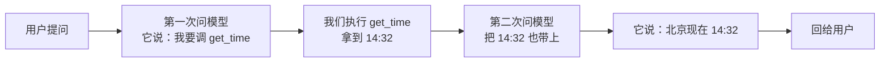
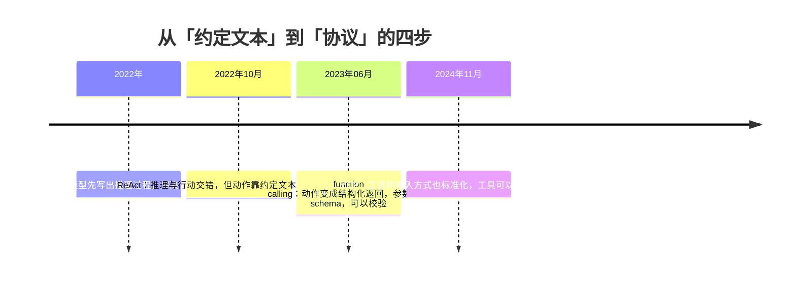
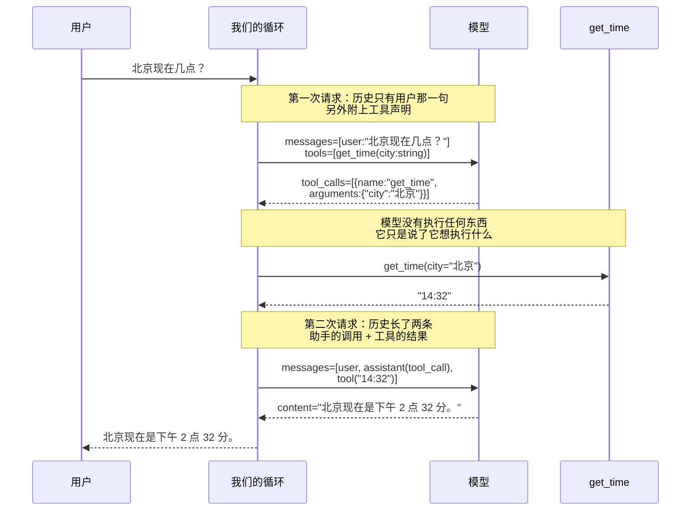
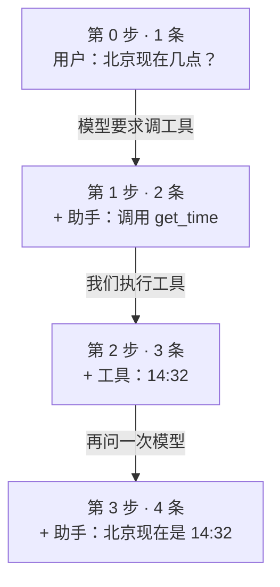

# 全景：agent 到底在做什么

## 一个答不上来的问题

打开任何一个大语言模型的对话框，问它：

> 北京现在几点？

你会得到两种回答之一。一种是老实话：「我无法获取实时信息。」另一种更麻烦——
它给你一个具体的时间，语气笃定，而那个时间是编的。

这件事值得停下来想一想。这个模型能写代码、能解数学题、能讨论哲学，
却答不出一个小学生都知道怎么查的问题。它缺的不是智力，是**一块表**。

再往下追一层：就算你在它旁边真的放一块表，它也读不了。因为它根本
**不具备「读」这个动作**。它能做的只有一件事——生成文字。

这一章要说清楚的就是：**当一个只会生成文字的东西需要与真实世界发生关系时，
中间要补上什么。** 补上的那层东西，就是 agent。

## 语言模型到底是什么

要理解 agent 为什么必须存在，得先把语言模型看清楚。抛开一切修辞，
它是一个**函数**：

> 输入一串文字，输出接下来最可能出现的文字。

就这一件事。它反复做这件事，一次吐一小块，攒起来就成了你看到的回答。

从这个定义能推出三条性质，它们是这门课后面所有设计的地基。

### 性质一：它没有状态

你和它聊了十轮，它并不「记得」前九轮。真相是：每一轮我们都把**之前的全部对话**
重新发了一遍。所谓「记忆」，是我们这边维护出来的假象。

这不是实现上的偷懒，是这类模型的本性——它是个纯函数，同样的输入永远给
同样分布的输出，两次调用之间不留任何东西。

这条性质在第 14 章会变成「会话要落盘」，在第 16 章会变成「历史太长要压缩」。
现在只要记住一句话：**记事的是我们，不是它。**

### 性质二：它没有副作用

模型的输出是文字，只是文字。它不会因为「说」了一句
「我现在去读一下 config.txt」就真的读到什么。

这一条听起来是废话，但它是整门课最容易被说错的地方。你会在很多文章里
读到「模型调用了搜索工具」——这句话严格来说是错的。发生的事情是：
**模型输出了一段结构化的文字，表达它想调用某个工具；我们的程序读到这段文字，
替它执行了。**

区别不是抠字眼。执行权在谁手里，决定了：

- 参数能不能被校验（第 9 章）
- 危险操作能不能要求人确认（第 18 章）
- 出错时能不能变成一条它能读懂的反馈而不是让程序崩掉（第 12 章）

如果模型真能自己执行，上面这些统统无从谈起。

### 性质三：它的知识有截止时间

模型的参数是训练那一刻固定下来的。之后世界发生的一切，它都不知道。
今天几号、你的项目叫什么、那个接口昨天改了没有——一概不知。

这三条性质合起来，把语言模型的能力边界划得很清楚：**它擅长判断和表达，
不擅长知道和执行。** 而现实里的任务，恰恰两样都要。

> [!要点]
> 语言模型是一个无状态、无副作用、知识有截止时间的文字生成函数。
> 它擅长判断和表达，不擅长知道和执行。agent 补的就是后面这一半。

## 补上缺的那一环

既然模型不能执行，那就我们替它执行。这个念头很朴素，但要落地需要两个条件。

**第一，它得能把意图说清楚。** 「我想知道北京时间」是不够的——我们的程序
没法从这句话里可靠地提取出「调用哪个函数、传什么参数」。它得说成
`get_time(city="北京")` 这种我们能直接解析的形式。

**第二，我们得能把结果还给它。** 拿到「14:32」之后，这个字符串对用户没有意义——
用户问的是「几点了」，不是「给我一个字符串」。得让模型把它组织成一句人话。
而要让模型看到它，只有一条路：**追加进历史，再问一次**。

第二个条件推出了一个不那么显然的结论：**一次用户提问，要调用模型不止一次。**



如果工具的结果还需要再查一次别的东西呢？那就再来一轮。什么时候停？
**模型不再要求调工具的时候。** 这就是循环。

整门课都在把这个循环做扎实：怎么让它停得下来（第 10 章）、
怎么让它并发（第 11 章）、怎么让它扛住模型犯病（第 12 章）、
怎么让它记得住（第 13 到 16 章）、怎么让它真的能干活又不闯祸（第 17 到 20 章）。

## 「agent」这个词的两段身世

在往下走之前，把这个词的来历交代清楚。它被用得太滥了，你以后读别人的文章
容易串台。

**第一段身世在大模型之前。** 人工智能的教科书里，agent 指的是
「能感知环境、并对环境采取行动的东西」。按这个定义，一个恒温器是 agent——
它感知温度，采取开关加热的行动；一个下棋程序是 agent；强化学习里那个
在环境中反复试错的主体，也叫 agent。这个用法强调的是**感知与行动构成的循环**，
跟语言模型没有半点关系。

**第二段身世是 2022 年之后。** 人们发现语言模型也能被放进这样一个循环里：
让它「说」出想做什么，我们替它做，把结果告诉它，它再决定下一步。
于是这个旧词被借来指这类系统。

两段身世共享同一个内核——**循环里有感知，有行动**。而它们最要紧的区别是：

| | 经典 agent | LLM agent |
|---|---|---|
| 谁决定做什么 | 它自己 | 它自己 |
| **谁真的动手** | **它自己** | **我们的代码** |
| 出了事谁负责 | 设计者 | 设计者，但有拦截的机会 |

中间那一行是这门课的主线。因为执行权在我们手里，我们才有机会在每一次动手之前
插一道检查。第 18 章会把这条线推到极致，那一章的主张是一句很重的话：
**提示词不是安全边界。**

> [!提示]
> 这一小段是背景，跳过不影响你读后面的代码。但如果你以后要跟人讨论
> 「agent 有没有自主性」这类问题，知道这个词有两段身世会让你少绕很多弯路。

## 这套模式是怎么被发现的

「让模型边想边做」不是一开始就有的。它有一条清晰的来路，知道这条路能帮你
理解为什么今天的接口长成现在这样。

### 第一步：让模型把思路说出来

早期人们发现，如果让模型在给答案之前先写出推理过程，正确率会明显提高。
这就是所谓的思维链。它解决的是「想」的问题，但模型仍然被关在自己的知识里——
想得再清楚，不知道就是不知道。

### 第二步：ReAct——想和做交错起来

2022 年 10 月，一篇叫 **ReAct** 的论文（Reasoning + Acting）把这件事讲透了。
它的主张是：推理和行动不该分开做，而该**交错着做**。原文摘要里的关键句是：

> "reasoning traces help the model induce, track, and update action plans as well as
> handle exceptions, while actions allow it to interface with and gather additional
> information from external sources such as knowledge bases or environments."

翻成人话：让模型一边说出思路、一边去外面取信息，两者互相帮忙——
思路帮它决定下一步该取什么，取回来的东西帮它修正思路。

这正是我们上一节推导出来的那个循环。ReAct 的贡献是把它作为一种通用方法
论证清楚了，并在问答、事实核查、文字游戏、网页操作四类任务上验证了效果。

**但当时的「行动」是怎么实现的？** 靠**约定文本格式**。提示词里教模型
输出这样的行：

```
Thought: 我需要查一下北京时间
Action: get_time[北京]
```

然后程序用正则去解析 `Action:` 那一行。这个方案能用，但很脆：模型多打一个空格、
把方括号写成圆括号、在动作前面多说一句话，解析就崩了。而且模型没有任何
「这个工具需要什么参数」的准确信息，全靠提示词里的自然语言描述。

### 第三步：function calling——把动作变成协议的一部分

2023 年 6 月，OpenAI 把这件事变成了 API 的一等公民：**function calling**。
你把可用函数的名字、用途、参数结构（用 JSON Schema 描述）声明给模型，
模型直接在响应里返回一个结构化的调用请求，不再需要你去解析自然语言。

这一步的意义比它看起来大：

- **解析不再脆弱**——返回的是 JSON，不是要你正则匹配的散文。
- **参数有了结构**——模型知道 `city` 是个字符串、`unit` 只能取两个值之一，
  我们也因此**能够校验**它填的对不对（第 9 章整章在讲这件事）。
- **多个调用可以并存**——同一轮里要求调三个工具是合法的（第 11 章会用到）。

同年 11 月，这个参数从 `functions` 改名成更通用的 `tools`。今天你看到的
几乎所有模型服务，都提供了这套接口或它的等价物。

### 第四步：MCP——工具的接入方式也标准化

2024 年 11 月，Anthropic 提出 **MCP**（Model Context Protocol）。
前面那一步标准化的是「模型怎么表达调用意图」，MCP 标准化的是
「工具怎么被接进来」——工具不必写死在你的程序里，可以由一个独立的服务提供，
任何支持 MCP 的 agent 都能用。



**这门课站在第三步上**：用结构化的工具调用，自己写循环。
为什么不直接讲第四步？因为 MCP 解决的是「工具从哪来」，而这门课要讲的是
「拿到工具之后怎么用好」。把第三步理解透了，MCP 只是换一个工具来源，
你半天就能接上。

## 一次往返，逐帧看

抽象说了这么多，看一次真实的往返。下面这张图上标注了每一步实际传的东西——
**每个箭头旁边的字就是那一步的数据本身**，不需要你回头去对照别处的说明。



三件事值得单独指出来。

**第一，模型被问了两次。** 用户看到的是一问一答，底下发生的是两次完整的
模型调用。这意味着延迟翻倍、费用翻倍——这是 agent 的固有成本，
后面「什么时候用不着 agent」那一节会用到这笔账。

**第二，工具的结果没有直接给用户。** 「14:32」不是答案，它是给模型的**原料**。
把原料组织成一句人话是模型的活。如果你直接把工具输出丢给用户，
那你写的不是 agent，是一个包了层皮的函数调用。

**第三，第二次请求里带着第一次的全部内容。** 用户那句话、模型的调用请求、
工具的结果，一条不少。这是性质一的直接后果。

## 动手之前，先预测

下一节的代码把上面那张时序图原样写出来。**先别急着点运行**——在心里回答三个问题，
再去看输出：

1. 那个 `for` 循环会转几轮？
2. 第一轮里 `reply["type"]` 的值是什么？
3. 如果把 `get_time` 的返回值从 `"14:32"` 改成 `"凌晨三点"`，
   最终那句回答会跟着变吗？

有实证研究做过这件事：让学生先预测代码的行为再运行，比直接看讲解和结果
学得更好，而且他们主观上觉得学编程「没那么费劲」。多花的三十秒是划算的。

## 三十行代码，一个完整的 agent

模型是假的——用几行判断冒充。这样不联网也能跑，而且每次结果都一样。
第 5 章会专门讲为什么**先用假模型**是这门课最重要的一个安排；
现在你只要知道，它在这里的作用是让你能盯住循环本身，不被网络和随机性干扰。

```python
def fake_model(history):
    """假模型。看历史里有没有工具结果：没有就要求调工具，有了就给最终回答。"""
    tool_outputs = [m["content"] for m in history if m["role"] == "tool"]
    if tool_outputs:
        return {"type": "text", "text": f"北京现在是 {tool_outputs[-1]}。"}
    return {"type": "tool_use", "name": "get_time", "args": {"city": "北京"}}


def get_time(city):
    return "14:32"


history = [{"role": "user", "content": "北京现在几点？"}]

for round_no in range(1, 6):
    reply = fake_model(history)

    if reply["type"] == "text":
        print(f"第 {round_no} 轮：模型给出最终回答 → {reply['text']}")
        break

    print(f"第 {round_no} 轮：模型要求调 {reply['name']}({reply['args']})")
    history.append({"role": "assistant", "content": f"调用 {reply['name']}"})
    output = get_time(**reply["args"])
    print(f"        我们执行了它，拿到 {output}")
    history.append({"role": "tool", "content": output})
```

对答案：

1. **两轮**。第一轮模型要求调工具，第二轮它给出答案。
2. **`"tool_use"`**。第一轮历史里还没有任何 `role == "tool"` 的消息。
3. **会变**。把返回值改掉再跑一次，你会看到最终答案跟着变了——
   这就是「工具结果是原料」的意思。模型没有独立的时间知识，
   它只是在复述我们喂给它的东西。

第三个问题背后有一层不太舒服的含义：**如果工具返回错的，模型就说错的。**
它没有能力核实。第 12 章会讲怎么识别工具出错，但「工具说什么它信什么」
这条本性是改不掉的——这也是为什么工具的可靠性比模型的聪明程度更要紧。

上面这三十行里，有 agent 的全部骨架：**一个循环，一个判断是否结束的条件，
一次执行，一次把结果追加进历史。** 剩下十九章都在给这个骨架加东西，
但骨架本身不会再变。

## 历史：这个列表是整件事的核心

`history` 这个列表看着不起眼，但它是这门课后半程所有麻烦的来源。
每一轮它都会变长：



```python
print(f"这次对话最终有 {len(history)} 条消息：\n")
for i, m in enumerate(history, 1):
    print(f"  {i}. {m['role']:9} {m['content']}")

print("\n每一次调用模型，发过去的都是当时的全部历史——模型自己不记事。")
```

### 一笔要算清楚的账

「每次都重发全部历史」这件事有代价，而且代价不是线性的。

假设一轮对话平均新增 200 个 token，那么：

| 第几轮 | 这一轮发送的量 | 累计发送的量 |
|---|---|---|
| 1 | 200 | 200 |
| 2 | 400 | 600 |
| 3 | 600 | 1200 |
| 10 | 2000 | 11000 |
| 20 | 4000 | 42000 |

单轮成本线性增长，**累计成本近似平方增长**。二十轮下来，你为最早那句话
付了二十次钱。

这笔账推出了三件事，都在后面有专章：

- 历史太长会超过模型的上下文上限 → **第 16 章：压缩**。
- 历史不能只活在内存里，进程一退就没了 → **第 14 章：持久化**。
- 用户想「重新生成一次」而不丢掉旧的那条 → **第 15 章：会话树**。

## 什么时候用不着 agent

这一节可能是全章最省钱的一节。

Anthropic 在一篇讲「怎么构建有效 agent」的工程文章里，把这类系统分成两种：

- **workflow**：模型和工具沿着**你预先写死的代码路径**被编排；
- **agent**：模型**自己决定**走哪条路、用什么工具、什么时候停。

它给出的建议很直白：

> "optimizing single LLM calls with retrieval and in-context examples is usually enough"

也就是说：**多数任务用不着 agent。** agent 是拿延迟和成本去换任务表现的——
上一节那笔账就是成本，前面那个「模型被问了两次」就是延迟。
只有当简单方案确实不够时，这层复杂度才值得加。

判据只有一句话：**你能不能提前画出这个任务的流程图？**

把它用到三个具体任务上：

| 任务 | 能画出流程图吗 | 该怎么做 |
|---|---|---|
| 把上传的文件读进来，总结成三百字 | 能：读文件 → 调一次模型 → 输出 | **workflow**。做成 agent 只是徒增两次往返 |
| 排查线上故障，下一步查什么取决于上一步看到的日志 | 不能：分支由内容决定 | **agent** |
| 把一段中文翻译成英文，如果超过 500 字就分段翻 | 能：一个 if 就能表达 | **workflow** |

第三个例子值得多说一句。「有条件分支」不等于「需要 agent」——
条件是你能写出来的，就写成代码。需要 agent 的是那种
**条件本身取决于模型对内容的判断**、你事先枚举不完的情况。

> [!坑]
> 最常见的浪费是把「读一个文件然后总结」做成 agent。
> 流程完全固定，一次模型调用加一次读文件就够了。
> 让模型自己决定要不要读文件，只是多花两倍的钱和时间去得到同一个结果。

## 三个常见的误解

**「agent 就是给模型套个提示词。」**
不是。提示词影响的是模型的措辞和倾向，而 agent 的本事来自**真的去执行**。
一个没有工具的「agent」，无论提示词写得多好，也答不出北京几点。
第 18 章会把这句话说得更狠：提示词不是安全边界——在系统提示里写
「不要删除文件」挡不住任何事，真正的边界必须是代码里的机制。

**「模型会自己调用工具。」**
不会。这一点前面说过两次，这里是第三次，因为它是后面所有权限设计的地基。
模型输出的永远只是文字（或结构化的调用请求）；执行的是我们。

**「循环轮数越多，做得越好。」**
不是。模型会陷入循环：反复用同样的参数调同一个工具，或者两个工具互相触发。
这类故障有一个共同特征——**不报错、不崩溃、程序看起来一切正常**，
只是永远不结束，而每一轮都在花钱。第 10 章会给循环装上预算，
第 12 章讲怎么识别它在犯病。

## 真实的实现是怎么组织的

这门课参照 **pi**（`earendil-works/pi`，MIT 协议，TypeScript 写的）来安排。
它是一个完整的 agent 工具箱，把整件事切成三个包：

| 包 | 职责 | 对应本课 |
|---|---|---|
| `pi-ai` | 统一各家模型的接口：消息、内容块、流式事件、工具声明 | 第 2、6、7、8 章 |
| `pi-agent-core` | agent 运行时：主循环、工具执行、状态、事件 | 第 3、9 到 13 章 |
| `pi-coding-agent` | 面向用户的编码 agent 命令行 | 第 17 到 20 章 |

**注意最底下那一层是「统一模型接口」，不是「主循环」。** 这个排法不是随手定的。

各家模型服务在很多细节上不一样：消息里工具结果放哪、流式事件叫什么名字、
工具声明用什么格式。这些差异如果不在最底层按平，会一路往上渗——
渗进主循环之后，每接一家新服务你都得改一遍循环，而循环是最不该被频繁改动的
那部分代码。

pi 支持三十多家模型服务，而它的主循环不知道自己接的是哪一家。
**这就是那条分界线的价值。** 第 6 章会专门造这一层，那时候你会更有体会。

> [!小结]
> 语言模型是一个无状态、无副作用、知识有截止时间的文字生成函数。
> agent 给它补上两样东西：能真的执行的工具，和一个反复追问的循环。
> 工具结果不是答案，是给模型的原料。记事的是我们，不是它。
> 多数任务用不着 agent——先问自己能不能画出流程图。

## 这门课怎么读

二十章分五个部分，每一部分解决一类问题：

| 部分 | 章 | 解决什么 | 读完你能做到 |
|---|---|---|---|
| 一、骨架与协议 | 1-5 | 消息怎么表示、事件怎么传、假模型怎么造 | 在不联网的情况下把主循环写完并测试 |
| 二、接上真模型 | 6-8 | 供应商差异、流式解析 | 换一家模型服务而调用方一行不改 |
| 三、agent 的心脏 | 9-12 | 工具契约、主循环、并发取消、模型犯病 | 写出一个能上线的循环 |
| 四、记忆 | 13-16 | 会话、落盘、分叉、压缩 | 让 agent 记得住、接得上、不撑爆 |
| 五、干活的 agent | 17-20 | 编码工具、权限沙箱、技能、评估 | 造一个真能改代码的 agent，并且知道它做得对不对 |

**每一章的代码都能直接跑，也能直接改。** 同一页的代码格共享一个长驻的
Python 环境，前面定义的东西后面能用；换一页就是全新的开始。
所以从第 10 章起，每章开头会有一行 `from agentlib import *`——
那是前面各章你逐格写出来的东西，一行没改，只是收进了课程目录里的一个包，
免得每章重贴两百行。想看某一段当初是怎么来的，直接打开 `agentlib/` 下的文件。

另有一门同样大纲的 Go 版。两边对照着看，能看清同一个机制在两种语言里的
不同写法——接口是隐式还是显式、取消靠约定还是靠 `context`、
错误是异常还是返回值。

## 练习

**第一题（不写代码）。** 本章说「模型被问了两次」。设想一个任务：
「查一下北京和纽约的时差」，而你只有一个 `get_time(city)` 工具。
模型会被问几次？画出时序图。

**第二题（不写代码）。** 下面三件事，哪些该用 workflow，哪些该用 agent？
说出你的判据。
（a）每天早上把昨天的错误日志汇总成一封邮件。
（b）给定一个报错栈，找出是哪一行代码的问题并改掉。
（c）把一个 Markdown 文件转成 HTML。

**第三题（改代码）。** 把上面那段代码里的 `fake_model` 改掉，
让它在第一轮要求调 `get_time`、第二轮**再**要求调一次 `get_time`（换个城市）、
第三轮才给最终回答。跑之前先预测循环会转几轮、历史里最终有几条消息。

**第四题（改代码）。** 把 `for round_no in range(1, 6)` 的上限改成 `2`，
再让 `fake_model` 永远返回 `tool_use`。观察会发生什么，
然后想一想：如果没有这个上限，会发生什么？
（这就是第 10 章「循环预算」要解决的问题。）

## 随堂自测

```quiz
- 题目: 用户问「北京现在几点」，一个带 get_time 工具的 agent 一共会调用几次模型？
  选项:
    A: 一次——模型直接给出答案
    B: 两次——第一次要求调工具，第二次根据结果给出答案
    C: 三次——还要一次来决定用哪个工具
  答案: B
  解析: 第一次调用模型返回的是「我要调 get_time」，不是答案；我们执行工具、把结果追加进历史之后，再问一次，它才给出最终回答。这就是「一轮对话，两次模型调用」，也是 agent 延迟和费用翻倍的来源。

- 题目: 下面哪件事更适合用 workflow 而不是 agent？
  选项:
    A: 排查一个线上故障，下一步查什么取决于上一步看到的日志
    B: 把用户上传的文件读进来，总结成三百字
    C: 帮我改一个 bug，需要先找到相关文件再改
  答案: B
  解析: 判据是「你能不能提前画出这个任务的流程图」。读文件加总结的流程是固定的，一次模型调用加一次读文件就够了，做成 agent 只是徒增往返。A 和 C 的下一步都取决于上一步的结果，画不出固定流程，才需要 agent。注意「有 if 分支」不等于「需要 agent」——条件你能写出来就写成代码。

- 题目: 「模型调用了 get_time 工具」这句话哪里说得不准确？
  选项:
    A: 没有不准确，模型确实调用了工具
    B: 模型只是输出了一个调用请求，真正执行的是我们的代码
    C: 应该说「工具调用了模型」
  答案: B
  解析: 模型没有副作用——它的输出永远只是文字（或结构化的调用请求），不具备执行任何东西的能力。执行权在我们的循环里。正因为如此，才谈得上校验参数、要人审批、限制范围，这是第 18 章全部权限设计的地基。

- 题目: 为什么每次调用模型都要把全部历史发过去？
  选项:
    A: 为了让模型知道我们还在
    B: 因为模型是无状态的，它上一次说过什么全靠我们再递一遍
    C: 因为接口协议要求必须这样
  答案: B
  解析: 模型是一个纯函数：给一串文字，吐一串文字，两次调用之间不留任何东西。会话的连续感完全是我们维护历史造出来的。这也解释了为什么累计成本近似平方增长，以及为什么第 14 章要持久化、第 16 章要压缩。

- 题目: 如果 get_time 工具返回了一个错误的时间，会发生什么？
  选项:
    A: 模型能察觉不对，会重新调用一次
    B: 模型会照着错的说，因为它没有独立的时间知识来核实
    C: 循环会报错并终止
  答案: B
  解析: 工具的结果是模型唯一的信息来源，它没有能力核实。这条本性改不掉，所以工具的可靠性比模型的聪明程度更要紧。第 12 章会讲怎么识别工具执行失败，但那是识别「工具报错了」，不是识别「工具说了假话」。
```

## 设计笔记：为什么这门课从一个假模型开始

这一节讨论的是取舍，不是实现，你可以跳过——但它解释了这门课后面十九章
的一个反复出现的安排。

从第 1 章到第 7 章，这门课**一次都不会真的调用模型**。这看起来很怪：
学 agent 却不连模型？

理由有三个。

**一，主循环的 bug 只有在确定性环境里才抓得住。** 真模型每次说的话都不一样。
你的循环少转了一轮，是循环写错了还是模型这次刚好不想调工具？分不清。
用剧本模型，你说它第一轮调工具它就调，出了偏差一定是你的代码问题。

**二，接口应该由使用它的人定，而不是由被使用的人定。** 如果一上来就接真模型，
你会不自觉地把那家服务的字段名、事件名、错误码渗进主循环。
先用假模型逼自己定义一个**你自己想要的**接口，等第 8 章接真模型时，
就变成「让真模型去适配这个接口」，而不是反过来。第 8 章会验证这件事：
换上真模型，调用它的代码一个字都不用改。

**三，它便宜、快、可重复。** 你会在这门课里反复跑同一段代码几十次。

代价是什么？假模型不会给你「真实模型有多不听话」的体感。所以从第 8 章起，
课程会一直用真模型，并且第 12 章专门讲它不听话时怎么办。
**两种模型都要用，用在不同的地方——这本身就是一个值得记住的工程判断。**

---

## 下一章预告

我们一直在用 `{"role": ..., "content": ...}` 这样的字典表示消息。它够用了吗？

考虑这种情况：模型在同一条回复里既说了一句话（「我查一下时间」），
又要求调用一个工具。一个 `content` 字符串装不下这两样东西。
下一章把消息重新建模成**一串内容块**，这是后面所有功能的地基。

---

**本章引用的资料**

- ReAct 论文：<https://arxiv.org/abs/2210.03629>
- OpenAI function calling 发布说明：<https://openai.com/index/function-calling-and-other-api-updates/>
- MCP 发布说明：<https://www.anthropic.com/news/model-context-protocol>
- Building effective agents：<https://www.anthropic.com/engineering/building-effective-agents>
- pi 仓库：<https://github.com/earendil-works/pi>
- 「先预测再运行」的实证：Tucker et al. (2024), *Prediction versus production for
  teaching computer programming*, Learning and Instruction 91
