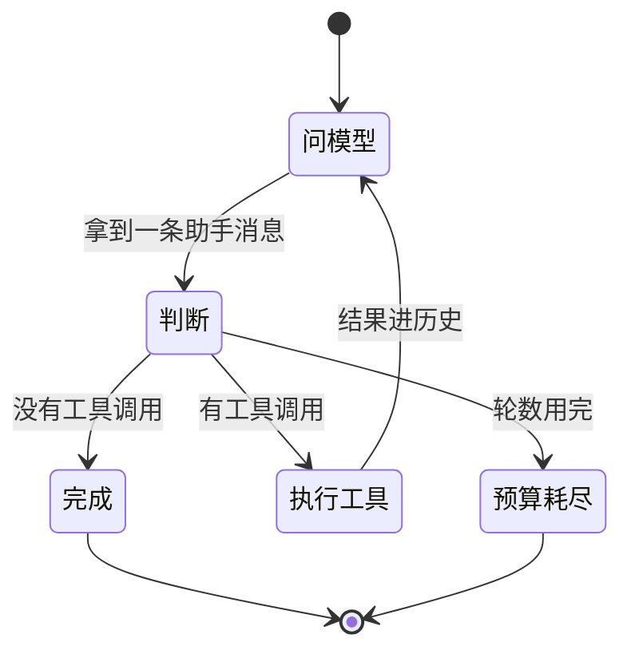
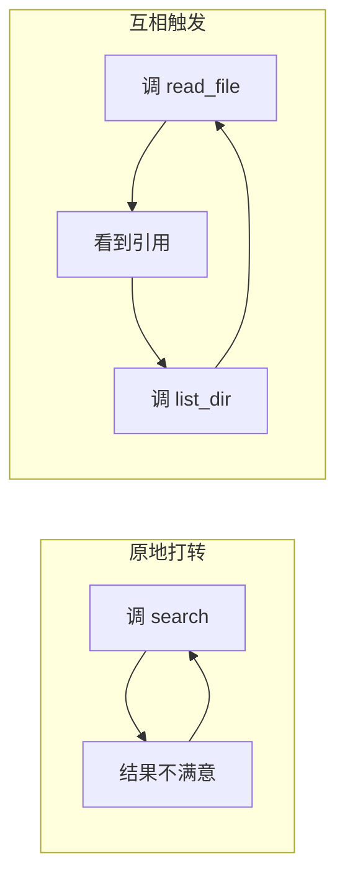

# 主循环

前面九章的 `run` 一直是个草稿：一个 for 循环，跑满次数就返回一句「循环次数用完了」。
这一章把它写成正经的东西。

主循环是 agent 的心脏。它只做一件事——**在模型和工具之间来回传话**——
但这件事里藏着四个必须回答的问题：

| 问题 | 答不好会怎样 |
|---|---|
| 什么时候停？ | 该停不停，或者该继续时提前收工 |
| 停不下来怎么办？ | 模型反复调同一个工具，一直烧钱直到你发现 |
| 一轮里多个工具调用怎么办？ | 用户干等着它们排队 |
| 每一步要让外界知道什么？ | 界面上一片空白，用户以为卡死了 |

这一章回答前两个和第四个，第三个留给下一章。

## 先看清楚循环的形状



图上有两个出口，不是一个。这是这一章第一个要点：

> **「答完了」和「预算用完了」是两种不同的结束**，调用方必须能区分。

前者可以直接把答案展示给用户；后者应该提示「它还没做完，要不要继续」。
如果 `run` 只返回一个字符串，这个区别就丢了——用户会把一句半截话当成最终答案。

## 本章起点

从这一章开始，前面各章的成果收进了课程自带的 `agentlib` 包。
它就是你前九章逐格写出来的东西，一行没改，只是不再每章重贴一遍。

想看某一段当初怎么来的，打开课程目录里的 `agentlib/`：
`blocks.py` 是第 2 章，`events.py` 是第 3 章，`wire.py` 是第 6、7 章，
`model.py` 是第 5、8 章，`tools.py` 是第 9 章。

```python
from agentlib import *

registry = default_registry()          # 第 9 章那两个工具：get_time 和 calculate
real_model = default_model()           # 第 8 章接上的本地模型

print("前九章的成果已就位，可用工具：", registry.names())
```

## 停止的四种理由

草稿版只有一种停法：模型不调工具了。真实的主循环有四种：

```python
from enum import Enum
from dataclasses import dataclass, field


class StopReason(str, Enum):
    COMPLETED = "completed"          # 模型给出了最终回答，正常结束
    BUDGET_EXHAUSTED = "budget"      # 循环预算用完了，它还想接着调工具
    CANCELLED = "cancelled"          # 外部要求停下（下一章讲）
    ERROR = "error"                  # 模型调用本身失败了


@dataclass
class TurnResult:
    """一轮的结果。

    为什么不只返回一个字符串：调用方需要区分上面那四种情况。
    尤其是「答完了」和「预算用完了」——前者可以直接展示，
    后者应该提示用户「它还没做完」。
    """
    text: str
    stop_reason: StopReason
    rounds_used: int
    messages: list = field(default_factory=list)   # 这一轮新增的消息
    error: str = ""

    @property
    def completed(self) -> bool:
        return self.stop_reason is StopReason.COMPLETED


print("四种停法就位")
```

## 为什么必须有预算

模型会陷入循环。最常见的两种形态：



两种都不会报错，不会崩，程序看起来一切正常——**只是永远不结束**。
一个没有预算的 agent 会一直烧钱直到你发现。

预算不是「防御性编程」那种可有可无的谨慎，它是**这个循环能不能上线的前提**。

## 事件流在这里派上用场

第 3 章造的事件流一直没怎么用。主循环是它真正的用武之地：
每一步都往流上发一件事，界面订阅它就能实时显示。

不这么做的替代方案是让主循环直接 `print`——那样换个界面（网页、命令行、日志）
就得改主循环。**发事件的人不该关心谁在听。**

主循环会发这几种：

| 事件 | 什么时候 | 界面拿它做什么 |
|---|---|---|
| `text_delta` | 模型每吐出几个字 | 打字机效果 |
| `tool_start` | 开始执行某个工具 | 显示「正在查询…」 |
| `tool_end` | 工具执行完 | 显示结果摘要、打勾或打叉 |
| `turn_done` | 这一轮结束 | 收起状态条，标明结束原因 |

## 写出来

```python
class AgentLoop:
    """一轮对话的主循环。

    职责边界很窄：只管「问模型 → 执行工具 → 再问模型」这个循环本身。
    历史存哪、会话怎么组织，是第 13、14 章的事。
    """

    def __init__(self, model, registry, stream=None, max_rounds=8):
        self.model = model
        self.registry = registry
        self.stream = stream or EventStream()
        self.max_rounds = max_rounds

    def run(self, history):
        turn_id = new_id("turn")
        new_messages = []
        self.stream.emit("turn_start", turn_id=turn_id)

        for round_no in range(1, self.max_rounds + 1):
            try:
                reply = self._one_round(history + new_messages)
            except Exception as exc:
                # 模型调用失败：网络断了、服务返回 500、响应格式不对。
                # 这类错误不该让调用方拿到一个异常——它拿到的应该是一个
                # 「这轮失败了」的结果，里面还带着已经产生的消息。
                self.stream.emit("error", turn_id=turn_id, message=str(exc))
                return TurnResult("", StopReason.ERROR, round_no, new_messages,
                                  error=f"{type(exc).__name__}: {exc}")

            new_messages.append(reply)
            calls = reply.tool_uses()

            if not calls:
                self.stream.emit("turn_done", turn_id=turn_id,
                                 reason=StopReason.COMPLETED.value)
                return TurnResult(reply.text(), StopReason.COMPLETED,
                                  round_no, new_messages)

            results = []
            for call in calls:
                self.stream.emit("tool_start", name=call.name, args=call.args)
                r = self.registry.execute(call.name, call.args)
                self.stream.emit("tool_end", name=call.name,
                                 ok=not r.is_error, output=r.content)
                results.append(ToolResultBlock(tool_use_id=call.id,
                                               content=r.content, is_error=r.is_error))
            new_messages.append(Message(role="tool", content=results))

        self.stream.emit("turn_done", turn_id=turn_id,
                         reason=StopReason.BUDGET_EXHAUSTED.value)
        return TurnResult(new_messages[-2].text() if len(new_messages) >= 2 else "",
                          StopReason.BUDGET_EXHAUSTED, self.max_rounds, new_messages)

    def _one_round(self, messages):
        """问一次模型，把增量转成事件，返回攒好的消息。"""
        text_parts, blocks = [], []
        for d in self.model.stream(messages, self.registry.specs()):
            if d.kind == "text":
                text_parts.append(d.text)
                self.stream.emit("text_delta", delta=d.text)
            elif d.tool is not None:
                if text_parts:
                    blocks.append(TextBlock(text="".join(text_parts)))
                    text_parts = []
                blocks.append(d.tool)
        if text_parts:
            blocks.append(TextBlock(text="".join(text_parts)))
        return Message(role="assistant", content=blocks)


print("主循环就绪")
```

一百行不到。**这一章新写的全部代码就是这些**——前面那些消息结构、
线上格式翻译、工具契约，都在 `agentlib` 里躺着，这里只是把它们串起来。

## 跑一次，看事件流

订阅几个事件，把它们打印出来。这段代码就是一个最简陋的「界面」：

```python
stream = EventStream()

def show(e):
    if e.kind == "text_delta":
        print(e.data["delta"], end="", flush=True)
    elif e.kind == "tool_start":
        print(f"\n  ⚙ 开始执行 {e.data['name']}({e.data['args']})")
    elif e.kind == "tool_end":
        mark = "✓" if e.data["ok"] else "✗"
        print(f"  {mark} {e.data['name']} → {e.data['output'][:60]}")
    elif e.kind == "turn_done":
        print(f"\n  ── 这一轮结束，原因：{e.data['reason']}")

stream.subscribe(show)

loop = AgentLoop(real_model, registry, stream)
result = loop.run([
    Message(role="system", content=[TextBlock(text="你可以使用工具。算数一律调用工具，不要心算。")]),
    Message(role="user", content=[TextBlock(text="(128 + 47) * 3 等于多少？再告诉我北京现在几点。")]),
])

print(f"\n停止原因：{result.stop_reason.value}")
print(f"用了 {result.rounds_used} 轮，新增 {len(result.messages)} 条消息")
print(f"最终答案：{result.text}")
```

看输出里事件的顺序：文字增量、工具开始、工具结束、下一轮的文字增量……
**一个 agent 界面需要显示的信息，全在这条流上。**

## 让预算真的用完

把预算压到 2 轮，再给它一个做不完的任务：

```python
tight = AgentLoop(real_model, registry, EventStream(), max_rounds=2)
result = tight.run([
    Message(role="system", content=[TextBlock(text="你可以使用工具。每次只算一步，不要一次算完。")]),
    Message(role="user", content=[TextBlock(text=
        "依次算出：1+1、然后结果乘 3、然后再加 10、然后再乘 2。每一步都要调用工具。")]),
])

print(f"停止原因：{result.stop_reason.value}")
print(f"用了 {result.rounds_used} 轮")
if result.stop_reason is StopReason.BUDGET_EXHAUSTED:
    print("→ 界面应当提示：它还没做完，要不要让它继续？")
```

这就是那两个出口的区别在代码里的样子。如果 `run` 只返回文本，
上面那个 `if` 根本写不出来。

## 一轮里可能有多个工具调用

模型可以在**同一轮**里同时要求算数和查时间。数一下它调了几次工具、用了几轮：

```python
counts = []
probe = EventStream()
probe.subscribe(lambda e: counts.append(e.data["name"]) if e.kind == "tool_start" else None)

result = AgentLoop(real_model, registry, probe).run([
    Message(role="system", content=[TextBlock(text="你可以使用工具。算数一律调用工具。")]),
    Message(role="user", content=[TextBlock(text="算一下 7*8，同时告诉我上海现在几点。")]),
])
print(f"一共调了 {len(counts)} 次工具：{counts}")
print(f"用了 {result.rounds_used} 轮 —— 如果是 1 轮，说明模型把两个调用放在了同一轮里")
print("答案：", result.text)
```

同一轮里的多个调用现在是**顺序执行**的。如果每个工具要跑几秒，用户就得等它们排队。
下一章解决这个，顺带解决「用户中途想喊停」。

## 本章小结

- 主循环的职责边界很窄：**只管问模型、执行工具、再问模型**。
- 循环有**两个出口**，不是一个。「答完了」和「预算用完了」要让调用方区分得开。
- **必须有循环预算**。模型陷入循环时不报错也不崩，只是永远不结束。
- 模型调用失败要变成「这轮失败了」的结果，**不要把异常抛给调用方**——
  它还需要那些已经产生的消息。
- 每一步都往事件流上发东西。**发事件的人不该关心谁在听**，
  否则换个界面就要改主循环。
- 这一章真正新写的代码不到一百行，其余都是前九章的积累。

下一章：同一轮里的多个工具调用**并发执行**，以及用户中途按下停止时怎么干净地退出。
难点不在「怎么停」，而在**停完之后对话历史还能不能用**。
