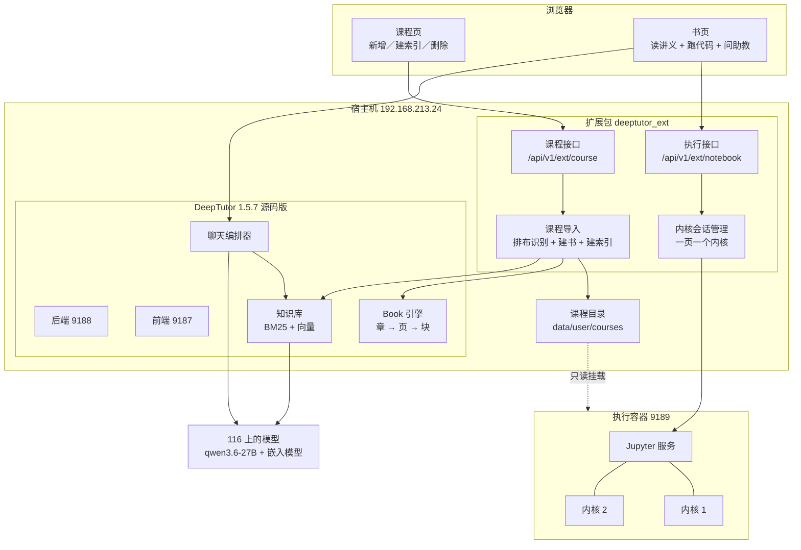

# 总览：这套东西是什么

这份文档是入口。想快速知道「有什么、在哪儿、怎么跑起来」，读这一篇就够；要动手改，再按下面的指引去读对应的专题。

| 文档 | 什么时候读 |
|---|---|
| 00-总览（本篇） | 第一次接手，或者隔了很久回来 |
| [01-部署与运维](01-部署与运维.md) | 要启停服务、升级 DeepTutor、排查故障 |
| [02-扩展接入机制](02-扩展接入机制.md) | 要加新工具、新接口，或者升级后发现扩展没生效 |
| [03-notebook 执行](03-notebook执行.md) | 要改代码运行、内核、输出渲染、执行容器 |
| [04-课程模块](04-课程模块.md) | 要支持新的课程排布、改导入逻辑、改课程页 |
| [05-踩坑与决策](05-踩坑与决策.md) | 遇到怪现象，或者想知道某个设计当初为什么这么选 |
| [06-opencode 接入](06-opencode接入.md) | 要接 opencode 或别的编码代理 |
| [07-实测记录](07-实测记录.md) | 要引用证据，或者复现某次验证 |

---

## 一句话

在 192.168.213.24 上跑着一套 DeepTutor，我们在**不改动它源码**的前提下给它加了两样东西：**课程模块**（把外部课程取进来变成可读可练可检索的一门课）和 **notebook 执行**（书页里的每段代码都能当场运行）。

---

## 三棵树

这是理解整套东西的第一件事：目录分三处，各有各的归属。

| 目录 | 是什么 | 谁改 | git |
|---|---|---|---|
| `~/DeepTutor-src` | DeepTutor 官方源码，停在 v1.5.7 | 原则上不改。确实必须改的，提交在 `local` 分支 | 上游仓库的浅克隆，加一个本地分支 |
| `~/DeepTutor-ext` | 我们的扩展包、运维脚本、文档、镜像定义 | 我们自己的地盘，升级完全不影响 | 独立仓库 |
| `~/DeepTutor` | 旧的 pip 安装版 1.5.6 | 保持原样，作为稳定版留着 | 无 |

前两者共用 `~/DeepTutor-src/.venv` 这一个虚拟环境。第三者有自己的环境和数据目录，两套并存、互不干扰。

**为什么要分三棵树**：整套设计的目标是「上游发新版时，我们的东西能快速接回去」。做法是把改动尽量赶出官方源码树——能放进扩展包的就放进去，实在要改源码的集中成几处小改动、提交在一个专门的分支上，升级时变基。详见 [02-扩展接入机制](02-扩展接入机制.md)。

---

## 端口

这台机器上端口比较拥挤，**选端口前务必先看 `ss -tln`**。

| 端口 | 归谁 | 绑定 |
|---|---|---|
| 9181 / 9182 / 9183 | pip 版 DeepTutor 1.5.6（前端／后端／使用手册） | 0.0.0.0 |
| 9184 | 可行性验证时起的实验容器，已清理 | — |
| 9185 | **novnc 的 websockify，不是我们的，别占** | 0.0.0.0 |
| 9187 / 9188 | 源码版 DeepTutor 1.5.7（前端／后端） | 0.0.0.0 |
| 9189 | 学生代码的执行容器 | 只绑 127.0.0.1 |
| 4096 / 4097 | opencode 服务与它的 OpenAI 兼容转接层（验证用，可停） | 只绑 127.0.0.1 |

改端口要同时改 `~/DeepTutor-src/data/user/settings/system.json`。DeepTutor 启动时会自己检测端口冲突并明确报错退出，不会默默漂移到别的端口。

---

## 组件关系



---

## 一门课导进来会变成什么

这是理解课程模块的关键。一门课**摊成三样东西**，各有各的用处：

| 产出 | 落在哪 | 学生在哪儿用到 |
|---|---|---|
| 课程目录 | `data/user/courses/<标识>/` | 执行容器只读挂载这一份；页面上跑代码时的工作目录就在里面 |
| 一本书 | `data/user/workspace/book/book_<id>/` | 书籍页里读讲义、跑代码、提问 |
| 一个检索索引 | 知识库 `course-<标识>` | 自动绑在书上，书页对话面板据此翻遍整门课回答问题 |

第三项是「融入 DeepTutor 现有学习流程」的关键：书页的对话面板本来就会在书绑了知识库时打开检索工具，所以导入时把课程正文建成知识库并绑上去，这件事就成了，前端一行都不用改。

---

## 现在装了什么课

| 课程 | 来源 | 规模 | 索引 |
|---|---|---|---|
| Hugging Face LLM 课程 | `github.com/huggingface/course` | 12 章 78 页，128 个可运行代码段 | 已建 |
| 微软机器学习入门课 | `github.com/microsoft/ML-For-Beginners` | 9 章 27 页，240 个可运行单元格 | 未建 |

---

## 五分钟上手

```bash
cd ~/DeepTutor-ext

make kernel-start   # 先起执行容器，否则页面上跑不了代码
make start          # 起 DeepTutor
make verify         # 接入自检，九项应该全过
```

然后打开 <http://192.168.213.24:9187/>：

- 侧栏「课程」→ 填一个 Git 仓库地址 → 取课程
- 侧栏「书籍」→ 打开那本课 → 每段代码旁边有「运行」「从头跑到这」「重置」「问助教」

---

## 与 pip 版的关系

`~/DeepTutor` 那套 1.5.6 仍在 9181 上跑，两套并存、数据目录不共享。源码版的模型配置是从 pip 版复制过来的，知识库和会话记录各自独立。

等源码版用稳了，再决定是把 pip 版停掉还是继续留着当稳定版。pip 版有自己的使用手册（`~/DeepTutor/docs/`，网页版在 <http://192.168.213.24:9183/manual.html>），那份手册讲的是 pip 版的安装配置，与本套文档不冲突但也不通用。
