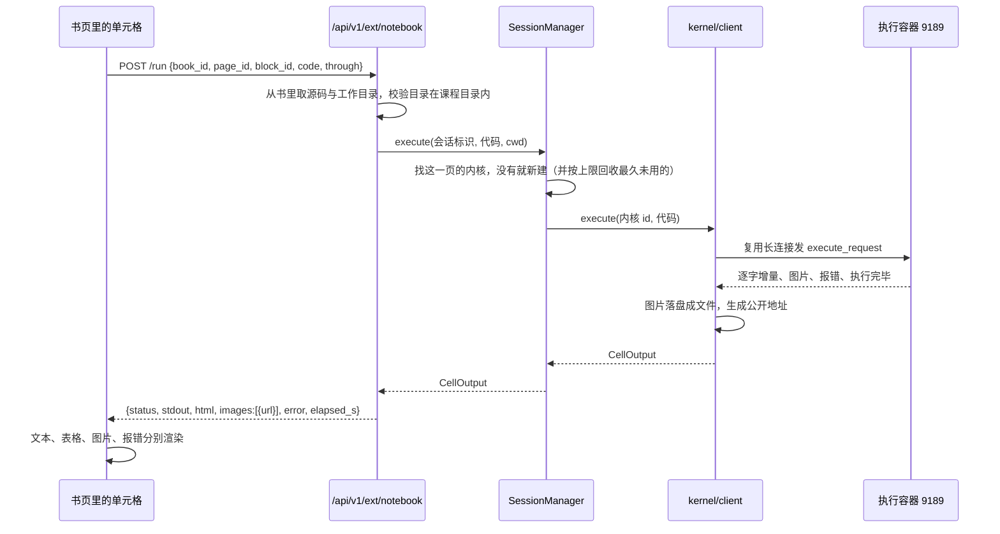

# notebook 执行

书页里每段代码都能当场运行。这一篇讲它是怎么实现的，以及要改哪里。

---

## 为什么不能用 DeepTutor 现成的代码执行

DeepTutor 自带两个执行类工具：`code_execution`（给一段源码和语言，跑完返回输出）与 `exec`（跑一条 shell 命令）。它们都经过沙箱层，隔离做得不错。

但它们是**一次性**的：每次执行都是全新的解释器，上一次定义的变量、加载的数据、训练好的模型全部丢失。

而 notebook 的教学价值恰恰建立在状态连续上——第 1 格读数据、第 5 格画图、第 12 格训练模型，靠的是同一个内核里累积的变量。所以必须另起一套：**长驻内核**。

---

## 架构



---

## 模块

`deeptutor_ext/kernel/`：

| 文件 | 职责 |
|---|---|
| `config.py` | 容器地址、口令读取、内核数上限、闲置回收时间、执行时限 |
| `client.py` | 与容器里的 Jupyter 服务通话：建内核、执行、收输出、关内核 |
| `outputs.py` | 把内核吐出的原始消息整理成结构化结果，图片落盘 |
| `session.py` | 学习会话与内核的对应关系、生命周期、并发上限 |

`deeptutor_ext/api.py` 里的 `router` 提供三个接口：

| 接口 | 做什么 |
|---|---|
| `POST /api/v1/ext/notebook/run` | 执行一格。`through=true` 时先把这一页排在前面的可运行格依次跑一遍 |
| `POST /api/v1/ext/notebook/reset` | 丢掉这一页的内核，下次运行是干净环境 |
| `GET /api/v1/ext/notebook/status` | 容器是否可用、当前有哪些活着的会话 |

---

## 几个关键设计

### 一页一个内核

会话标识是 `{book_id}:{page_id}`。页在课程里对应一课，也就对应一份 notebook，这个粒度最符合学生的直觉：同一课里前后格子共享变量，换一课重新开始。

内核数上限默认 6（`DEEPTUTOR_EXT_MAX_KERNELS`），超了回收最久没用过的。闲置 30 分钟（`DEEPTUTOR_EXT_KERNEL_IDLE_S`）自动回收——学生看讲解、写作业的间隙不该被打断，所以给得比较宽。

### 工作目录必须切到 notebook 所在位置

课程里的代码用的是 `'../../data/US-pumpkins.csv'` 这样的相对路径。内核建好后先执行一次 `os.chdir(...)`，之后 `cwd` 不变就不再切。

这个 `cwd` 从块的 payload 里读，而 payload 是导入时写的。接口侧**必须校验它在课程目录之内**——那个值最终会交给内核去 `chdir`，虽然越界的路径在容器里本来就看不到（只挂了课程目录），但在接口层拒绝更清楚，也能挡住把别处路径写进书里的情况。

### 产物地址由实际路径推导，不要手拼

图片写成文件放在 `get_task_workspace("chat", "notebook_<会话标识>") / "code_runs"`，公开地址这样算：

```python
relative = workdir.resolve().relative_to(path_service.get_public_outputs_root().resolve())
url_prefix = "/api/outputs/" + relative.as_posix()
```

**为什么不能手拼**：DeepTutor 对哪些路径可以经 `/api/outputs` 公开有一份白名单（`path_service.is_public_output_path`），我们沿用的是 `workspace/chat/<任务>/code_runs/` 这条规则。但 `get_task_workspace("chat", …)` 实际落在 `workspace/chat/chat/` 下——中间多一层。手拼漏掉那一层的后果是**前端图裂而后端一切正常**，很难一眼归因。这个坑真的踩过，见 [05 篇](05-踩坑与决策.md)。

### 每个内核一条长连接

一开始是每执行一格新建一条 WebSocket 连接，结果连着跑好几格时后面的格子会卡到超时：新连接刚建立、服务端还没把它接到内核的消息通道上，我们发出去的执行请求已经出去了，内核回的消息广播时这条连接还没在收，于是永远等不到「执行完毕」。

现在每个内核保持一条长连接，连上后先发一次内核信息查询并等回复，确认通道真的通了再开始干活。同一内核同一时刻只跑一格，用一把锁串行化。

### 输出的四类

`OutputCollector` 把内核消息整理成：

| 类型 | 来源消息 | 前端怎么用 |
|---|---|---|
| 文本流 | `stream` | 直接显示；标准错误单独一栏 |
| 结果值 | `execute_result` / `display_data` 里的 `text/plain` | 没有 HTML 时显示它 |
| 表格 | 同上里的 `text/html` | pandas 的 DataFrame 走这里，优先显示 |
| 图片 | 同上里的 `image/*` | 落盘成文件，返回地址，前端用 `` |
| 报错 | `error` | 名称、说明、回溯分别显示；回溯先洗掉终端配色转义字符 |

给模型读的文本（`for_model`）会把图片压成一句「生成了 N 张图」，不塞 base64——一张普通图表的 base64 有两三万个字符，塞进上下文既浪费又没用。

---

## 前端组件

`web/app/(workspace)/book/components/blocks/RunnableCell.tsx`（338 行）。

**分派逻辑**在 `CodeBlock.tsx`：块的 payload 里有 `notebook.runnable` 就渲染可运行版本，否则保持原来的静态展示。所以书里由模型写出来的示例代码不受影响。

单元格上有四个动作：

| 按钮 | 行为 |
|---|---|
| 运行 | 只跑这一格 |
| 从头跑到这 | 先把这一页排在前面的可运行格依次跑一遍，再跑这一格。学生跳着运行会撞上「变量没定义」，这是给他们的一键补齐 |
| 重置 | 丢掉这一页的内核，从干净环境重新开始 |
| 问助教 | 把这一格的代码、输出、报错打包成一个自定义事件派发出去 |

代码区是一个 `textarea`，学生可以直接改，改过会显示「已修改」标记并多出一个「还原」按钮。运行时传的是学生改后的代码。

报错时会给一句可操作的提示：`NameError` 提示去点「从头跑到这」，其余提示可以点「问助教」。

**表格 HTML 的处理**：内核返回的 `text/html` 要原样插进页面才能显示 pandas 表格。内容来自学生自己运行的代码，但仍然剥掉了脚本标签、iframe 和事件属性——万一学生照着别处贴来的代码运行，不该让它顺手在页面上执行脚本。多用户环境建议再接一个成熟的净化库。

---

## 「问助教」是怎么接上的

单元格派发事件，书页监听：

```
RunnableCell  --dispatchEvent('ext:ask-about-cell')-->  book/page.tsx
                                                        setCellQuestion(拼好的问题)
                                                        setChatOpen(true)
                                                              ↓ prefill 参数
                                                        BookChatPanel 填进输入框
```

问题模板按情况分三种：报错时问「这是什么原因，该怎么改」；有输出时问「请解释这段代码做了什么，结果说明了什么」；都没有时问「请解释这段代码做了什么」。学生可以在发送前补一句自己的疑问。

用事件而不是逐层传回调的理由见 [02 篇](02-扩展接入机制.md)。

---

## 要改的时候

| 想改什么 | 改哪里 |
|---|---|
| 内核数上限、闲置时间、执行时限 | `kernel/config.py`，或对应的环境变量 |
| 支持新的输出类型（比如交互式图表） | `kernel/outputs.py` 的 `_absorb_data` |
| 执行接口的行为（比如加「跑完整页」） | `deeptutor_ext/api.py` 的 `run_cell` |
| 单元格的样子与交互 | `RunnableCell.tsx` |
| 容器里装什么库 | `kernel-image/Dockerfile`，然后 `make kernel-build` |
| 容器的挂载与限额 | `bin/kernel-container.sh` |

---

## 已知的边界

- **同一页并发运行会排队**：一个内核一把锁，串行执行。学生自己一个人用没问题，多人同时点同一页会互相等。
- **没有中断按钮**：超时会自动中断，但学生没法主动停掉一个跑飞的格子。接口层有 `interrupt` 的调用，前端没接。
- **产物不清理**：图表文件一直堆在工作目录里。长期用要加定期清理。
- **模型下载走公网**：Hugging Face 课程的代码要从 huggingface.co 拉模型。这台机器目前通；不通的话可以在容器里设 `HF_ENDPOINT` 指向镜像站，或提前把常用模型拉进缓存目录。
